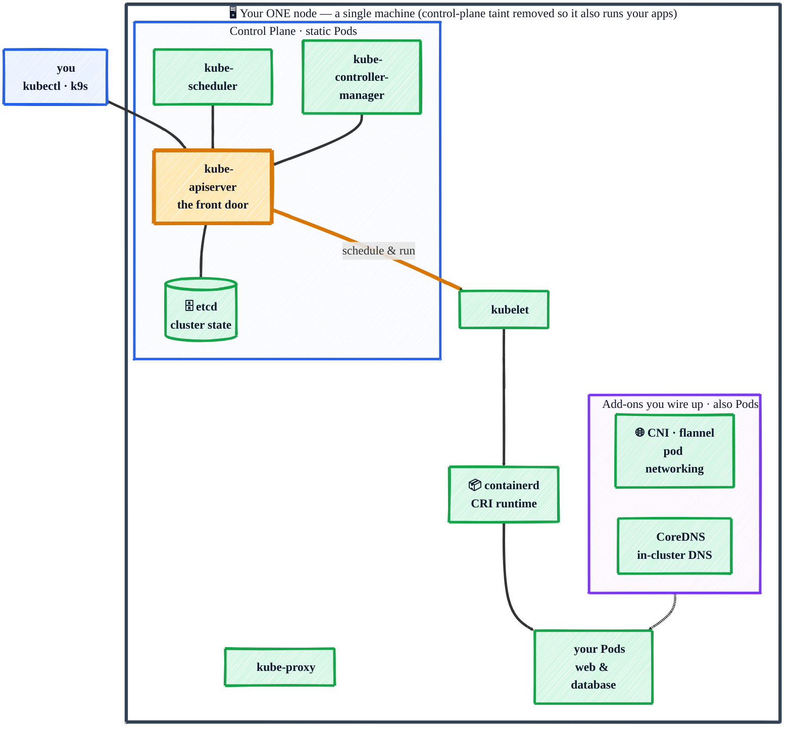

# Kubernetes in Practice

> _Learn **real** Kubernetes by building it with `kubeadm` — every component in the open, no toy clusters._


[](LICENSE)

> **Problem**: Running containers by hand — `docker run` on one machine, restarting them when they crash, wiring up networking, scaling by copy-paste — falls apart the moment you have more than one container or more than one machine.
>
> **Solution**: Kubernetes lets you *declare* the desired state of your apps in YAML and continuously reconciles reality to match it — self-healing, scaling, rolling out new versions, and routing traffic, all repeatably.

Most Kubernetes tutorials hand you a toy cluster (minikube, kind) that hides how things actually work. **This one is different.** You stand up a real, upstream Kubernetes cluster with **[kubeadm](https://kubernetes.io/docs/reference/setup-tools/kubeadm/)**, learn it by taking every component apart — `kube-apiserver`, `etcd`, `kubelet`, the CNI — and then put it to work, watching the cluster live in **[k9s](https://k9scli.io)**.

Every concept is paired with a runnable `kubectl apply` example, all building toward one concrete outcome: **deploying a two-tier app (web + database)** — configured with ConfigMaps/Secrets, persisted on a PVC, exposed through a Service + Ingress — then rolling out an update and tearing it back down.

> **No prior Kubernetes experience assumed.** New to k8s? Read top to bottom. Already know the basics? Jump straight to the [Table of Contents](#table-of-contents).

<!-- HERO GIF — record once the capstone is built:
     a short screen capture of k9s showing the two-tier app's Pods/Services going Ready,
     plus a browser reaching the app through the Ingress.
     Save it to docs/images/demo.gif and replace this comment with:
      -->

**The single-node cluster you'll build by hand — control plane _and_ your app on one machine:**



> Every box above is something you set up and understand with **kubeadm** — not a black box a one-line installer hid from you.

> **"kubeadm" is not a different kind of Kubernetes.** It's the official *installer* that assembles upstream components the standard way — so a kubeadm cluster **is** plain, vanilla Kubernetes (the same thing the official docs and the CKA exam describe). k3s, by contrast, is a *repackaged lightweight distro* with batteries-included defaults baked in. Analogy: Kubernetes is the Linux kernel, kubeadm is a clean standard install, k3s is a pre-loaded distro like Ubuntu. More in [Architecture Overview](docs/getting-started/architecture.md).

## What You'll Learn

By the end you'll be able to:

- **Read the architecture** and say what each component does — control plane vs. node (see the [diagram above](#kubernetes-in-practice)).
- **Deploy and expose apps** with the core objects: Pods, Deployments, Services.
- **Separate config from images** with ConfigMaps and Secrets, and **persist data** with PersistentVolumeClaims.
- **Keep apps healthy and current** — health probes, resource limits, scaling, and rolling updates with rollback.
- **Route traffic in** with an Ingress, and **debug** confidently when things break.
- **Tie it all together** in the [capstone](docs/capstone/two-tier-app.md): a two-tier web + database app — configured, persisted, and exposed — then updated and torn down.

Every section is hands-on: a manifest you `kubectl apply`, then watch take effect.

## Prerequisites

A Linux host (or WSL2 / a VM), `kubectl` installed, and basic shell + container familiarity.

**You'll need a cluster to follow along. Two ways to get one:**

1. **The real lesson — build it with kubeadm.** Provision the single-node cluster with the companion **[Ansible tutorial → kubeadm Role](https://github.com/r97221004/ansible-tutorial#kubeadm-role)**, then read [Set Up a Cluster (kubeadm)](docs/getting-started/setup-kubeadm.md) to understand every component you just stood up. This is the path the guide is built around.
2. **Fast lane — just want to run the examples?** Spin up a real single-node cluster with k3s in one line and circle back to kubeadm later:

   ```bash
   curl -sfL https://get.k3s.io | sh -s - --write-kubeconfig-mode 644
   export KUBECONFIG=/etc/rancher/k3s/k3s.yaml   # so plain kubectl just works
   ```

## Table of Contents

**Getting Started**

- [**What is Kubernetes?**](docs/getting-started/what-is-kubernetes.md) — declarative vs. imperative; the one idea behind everything.
- [**Architecture Overview**](docs/getting-started/architecture.md) — every component, and why a kubeadm cluster is vanilla k8s.
- [**Set Up a Cluster (kubeadm)**](docs/getting-started/setup-kubeadm.md) — build the cluster, then understand each piece the installer wires up.
- [**kubectl 101**](docs/getting-started/kubectl-101.md) — the everyday commands you'll live in.
- [**Anatomy of a Manifest**](docs/getting-started/manifest-anatomy.md) — `apiVersion`/`kind`/`metadata`/`spec`, once and for all.
- [**Inspect with k9s**](docs/getting-started/k9s.md) — a live terminal dashboard for your cluster.

**Part 1 — Core Objects**

- [**Pod**](docs/core-objects/pod.md) — the smallest thing Kubernetes runs.
- [**Deployment**](docs/core-objects/deployment.md) — keep N replicas alive and roll out updates.
- [**ReplicaSet**](docs/core-objects/replicaset.md) — what actually maintains the replica count.
- [**DaemonSet (intro)**](docs/core-objects/daemonset.md) — one Pod per node.
- [**Job & CronJob**](docs/core-objects/job-cronjob.md) — batch and scheduled work.
- [**Service**](docs/core-objects/service.md) — a stable address + load balancer for Pods.
- [**Namespace**](docs/core-objects/namespace.md) — partition the cluster.
- [**Labels & Selectors**](docs/core-objects/labels-selectors.md) — the glue wiring objects together.

**Part 2 — Configuration & Data**

- [**ConfigMap**](docs/config-and-data/configmap.md) — keep config out of the image.
- [**Secret**](docs/config-and-data/secret.md) — sensitive values.
- [**Environment Variables & Mounts**](docs/config-and-data/env-and-mounts.md) — how config reaches the container.
- [**Volumes & PersistentVolumes**](docs/config-and-data/volumes.md) — storage that survives restarts.
- [**StatefulSet (intro)**](docs/config-and-data/statefulset.md) — stable identity + storage for stateful apps.

**Part 3 — Running & Operating**

- [**Health Checks**](docs/running-and-operating/health-checks.md) — liveness / readiness / startup probes.
- [**Resource Requests & Limits**](docs/running-and-operating/resources.md) — CPU/memory scheduling and caps.
- [**Scaling**](docs/running-and-operating/scaling.md) — manual and autoscaling.
- [**Rolling Update & Rollback**](docs/running-and-operating/rolling-updates.md) — zero-downtime releases, instant undo.
- [**Debugging**](docs/running-and-operating/debugging.md) — the commands that explain a broken Pod.

**Part 4 — Networking & Access**

- [**Service Discovery & DNS**](docs/networking/dns.md) — find Pods by name.
- [**Ingress**](docs/networking/ingress.md) — route external traffic by host/path.

**Part 5 — Packaging & Beyond**

- [**Helm (intro)**](docs/packaging/helm.md) — the Kubernetes package manager.
- [**Kustomize (intro)**](docs/packaging/kustomize.md) — overlay-based config.

**Capstone**

- [**Deploy a Two-Tier App**](docs/capstone/two-tier-app.md) — web + database, end to end.
- [**Cleanup**](docs/capstone/cleanup.md) — tear it all back down.

**Appendix**

- [**kubectl Cheat Sheet**](docs/appendix/cheatsheet.md) — one-page reference.
- [**Troubleshooting**](docs/appendix/troubleshooting.md) — symptom → cause → fix.
- [**Further Reading**](docs/appendix/further-reading.md) — advanced topics beyond this guide.
