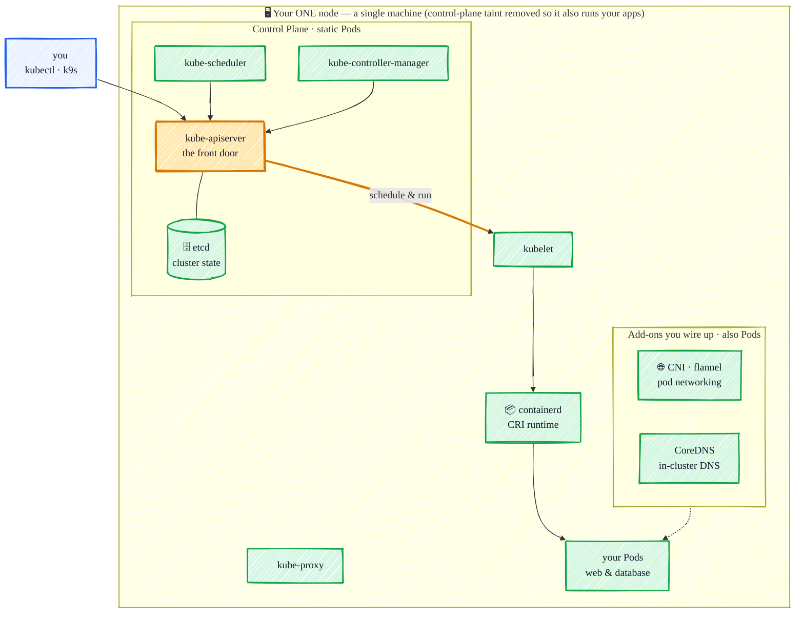

# Kubernetes in Practice

> _Learn **real** Kubernetes by building it with `kubeadm` — every component in the open, no toy clusters._


[](LICENSE)

> **Problem**: Running containers by hand — `docker run` on one machine, restarting them when they crash, wiring up networking, scaling by copy-paste — falls apart the moment you have more than one container or more than one machine.
>
> **Solution**: Kubernetes lets you *declare* the desired state of your apps in YAML and continuously reconciles reality to match it — self-healing, scaling, rolling out new versions, and routing traffic, all repeatably.

Most Kubernetes tutorials hand you a toy cluster (minikube, kind) that hides how things actually work. **This one is different.** You stand up a real, upstream Kubernetes cluster with **[kubeadm](https://kubernetes.io/docs/reference/setup-tools/kubeadm/)**, learn it by taking every component apart — `kube-apiserver`, `etcd`, `kubelet`, the CNI — and then put it to work, watching the cluster live in **[k9s](https://k9scli.io)**.

Every concept is paired with a runnable `kubectl apply` example, all building toward one concrete outcome: **deploying a two-tier app (web + database)** — configured with ConfigMaps/Secrets, persisted on a PVC, exposed through a Service + Ingress — then rolling out an update and tearing it back down.

> **No prior Kubernetes experience assumed.** New to k8s? Read top to bottom. Already know the basics? Jump straight to the [Table of Contents](#table-of-contents).

<!-- HERO GIF — record once the capstone is built:
     a short screen capture of k9s showing the two-tier app's Pods/Services going Ready,
     plus a browser reaching the app through the Ingress.
     Save it to docs/images/demo.gif and replace this comment with:
      -->

**The single-node cluster you'll build by hand — control plane _and_ your app on one machine:**



> Every box above is something you set up and understand with **kubeadm** — not a black box a one-line installer hid from you.

## Table of Contents

**Getting Started**

- [**What is Kubernetes?**](#what-is-kubernetes)
- [**What You'll Learn**](#what-youll-learn)
- [**Prerequisites**](#prerequisites)
- [**Architecture Overview**](#architecture-overview)
- [**Set Up a Cluster (kubeadm)**](#set-up-a-cluster-kubeadm)
- [**kubectl 101**](#kubectl-101)
- [**Anatomy of a Manifest**](#anatomy-of-a-manifest)
- [**Inspect with k9s**](#inspect-with-k9s)

**Part 1 — Core Objects**

- [**Pod**](#pod)
- [**Deployment**](#deployment)
- [**ReplicaSet**](#replicaset)
- [**DaemonSet (intro)**](#daemonset-intro)
- [**Job & CronJob**](#job--cronjob)
- [**Service**](#service)
- [**Namespace**](#namespace)
- [**Labels & Selectors**](#labels--selectors)

**Part 2 — Configuration & Data**

- [**ConfigMap**](#configmap)
- [**Secret**](#secret)
- [**Environment Variables & Mounts**](#environment-variables--mounts)
- [**Volumes & PersistentVolumes**](#volumes--persistentvolumes)
- [**StatefulSet (intro)**](#statefulset-intro)

**Part 3 — Running & Operating**

- [**Health Checks**](#health-checks)
- [**Resource Requests & Limits**](#resource-requests--limits)
- [**Scaling**](#scaling)
- [**Rolling Update & Rollback**](#rolling-update--rollback)
- [**Debugging**](#debugging)

**Part 4 — Networking & Access**

- [**Service Discovery & DNS**](#service-discovery--dns)
- [**Ingress**](#ingress)

**Part 5 — Packaging & Beyond**

- [**Helm (intro)**](#helm-intro)
- [**Kustomize (intro)**](#kustomize-intro)

**Capstone**

- [**Deploy a Two-Tier App**](#deploy-a-two-tier-app)
- [**Cleanup**](#cleanup)

**Appendix**

- [**kubectl Cheat Sheet**](#kubectl-cheat-sheet)
- [**Troubleshooting**](#troubleshooting)
- [**Further Reading**](#further-reading)

---

## Getting Started

### What is Kubernetes?

Kubernetes (often shortened to **k8s** — "k", eight letters, "s") is an open-source system for running containers across a pool of machines. You hand it a **desired state** — _"run three copies of this web app, reachable on port 80"_ — written as YAML, and Kubernetes makes reality match it and keeps it that way: if a container crashes it restarts it, if a machine dies it reschedules the work elsewhere, if you ask for more copies it spreads them out for you.

The mental shift from `docker run` is **declarative vs. imperative**:

- **Imperative** (Docker): you issue commands that each change the system — _"start this container"_, _"now restart it"_, _"now run another"_. You own every step.
- **Declarative** (Kubernetes): you describe the end state in a file and let the cluster's **control loops** continuously reconcile toward it. You own the goal; the cluster owns the steps.

That single idea — _declare the goal, let controllers converge on it_ — is the thread running through every object in this guide.

### What You'll Learn

By the end you'll be able to:

- **Read the architecture** and say what each component does — control plane vs. node (see the [diagram up top](#kubernetes-in-practice)).
- **Deploy and expose apps** with the core objects: Pods, Deployments, Services.
- **Separate config from images** with ConfigMaps and Secrets, and **persist data** with PersistentVolumeClaims.
- **Keep apps healthy and current** — health probes, resource limits, scaling, and rolling updates with rollback.
- **Route traffic in** with an Ingress, and **debug** confidently when things break.
- **Tie it all together** in the [capstone](#deploy-a-two-tier-app): a two-tier web + database app — configured, persisted, and exposed — then updated and torn down.

Every section is hands-on: a manifest you `kubectl apply`, then watch take effect.

### Prerequisites

_TODO — a Linux host (or WSL2 / a VM), `kubectl` installed, and basic shell + container familiarity._

**You'll need a cluster to follow along. Two ways to get one:**

1. **The real lesson — build it with kubeadm.** Provision the single-node cluster with the companion **[Ansible tutorial → kubeadm Role](https://github.com/r97221004/ansible-tutorial#kubeadm-role)**, then read [Set Up a Cluster (kubeadm)](#set-up-a-cluster-kubeadm) to understand every component you just stood up. This is the path the guide is built around.
2. **Fast lane — just want to run the examples?** Spin up a real single-node cluster with k3s in one line and circle back to kubeadm later:

   ```bash
   curl -sfL https://get.k3s.io | sh -s - --write-kubeconfig-mode 644
   export KUBECONFIG=/etc/rancher/k3s/k3s.yaml   # so plain kubectl just works
   ```

### Architecture Overview

> **First, clear up a common beginner confusion: "kubeadm" is not a different kind of Kubernetes.**
>
> - **Kubernetes** is the system itself (the components below).
> - **kubeadm** is just the official *installer* that assembles those components the standard way — so a "kubeadm cluster" **is** plain, upstream Kubernetes, exactly as the official docs (and the CKA exam) describe it.
> - **k3s** is also Kubernetes, but a *repackaged lightweight distribution* with batteries-included defaults (Traefik, ServiceLB, local-path) baked in.
>
> Analogy: Kubernetes is the Linux kernel, **kubeadm** is a clean standard install, **k3s** is a pre-loaded distro like Ubuntu. We use kubeadm here precisely so nothing is hidden — you see every component for what it is.

_TODO — the component map readers should carry through the whole tutorial:_

- **Control plane** — `kube-apiserver` (the front door / REST API), `etcd` (cluster state store), `kube-scheduler` (assigns Pods to nodes), `kube-controller-manager` (reconciliation loops).
- **Node** — `kubelet` (runs Pods, talks to the API server), `kube-proxy` (Service networking), the **container runtime** (`containerd`).
- **Add-ons** — **CNI** (pod networking, here flannel), **CoreDNS** (in-cluster DNS).
- _Refer back to the [diagram at the top](#kubernetes-in-practice); here we trace what happens on a `kubectl apply`: kubectl → apiserver → etcd → scheduler → kubelet → containerd._

### Set Up a Cluster (kubeadm)

> ⚠️ **Build the cluster before starting this chapter.** The install steps aren't repeated here — they're fully covered in the companion Ansible tutorial, which provisions this exact single-node kubeadm cluster over SSH: **[r97221004/ansible-tutorial → kubeadm Role](https://github.com/r97221004/ansible-tutorial#kubeadm-role)**. Run that first. Once the cluster is up, this section explains **what each piece it installed actually is**, so the cluster isn't a black box.

_TODO — walk through each component the installer wires up, in pipeline order, explaining the "why":_

1. **Kernel prerequisites** — `overlay` + `br_netfilter` modules and the `net.bridge.*` / `ip_forward` sysctls: why pod traffic needs them; why swap must be off.
2. **containerd (the CRI runtime)** — what the Container Runtime Interface is; why the **systemd cgroup driver** must match kubelet.
3. **kubelet / kubeadm / kubectl** — the node agent vs. the bootstrapper vs. the client; why versions are held/pinned.
4. **`kubeadm init`** — what it actually creates: control-plane static Pods (apiserver, etcd, scheduler, controller-manager), the `--pod-network-cidr`, and the kubeconfig at `/etc/kubernetes/admin.conf`.
5. **CNI (flannel)** — why nodes stay `NotReady` until a CNI is applied; what the pod network CIDR binds to. _(Multi-node note: the CNI's real job is routing Pod traffic **across** nodes via an overlay — on one node that cross-node magic stays hidden, but it's why a CNI is mandatory.)_
6. **Single-node scheduling** — the `node-role.kubernetes.io/control-plane` taint and why you remove it to run workloads on one node.

> **Heads-up — vanilla k8s ships fewer batteries than k3s.** There is no default StorageClass, LoadBalancer provider, or Ingress controller. Those are installed in their own chapters: local-path-provisioner ([Volumes](#volumes--persistentvolumes)), MetalLB or NodePort ([Service](#service)), ingress-nginx ([Ingress](#ingress)).

### kubectl 101

_TODO_

### Anatomy of a Manifest

_TODO — every object shares the same top-level fields: `apiVersion`, `kind`, `metadata`, `spec` (plus a `status` the cluster fills in). Read one Pod manifest field by field so every YAML later in the guide feels familiar._

### Inspect with k9s

_TODO — install k9s, navigate Pods/Services/logs in the terminal UI as a companion to kubectl._

## Part 1 — Core Objects

### Pod

_TODO_

### Deployment

_TODO_

### ReplicaSet

_TODO_

### DaemonSet (intro)

_TODO — runs exactly one Pod per node (log shippers, monitoring agents, CNI). Contrast with a Deployment's "N replicas placed anywhere."_

> 📝 **Multi-node note:** a DaemonSet places one Pod on _every_ node. On this single-node cluster you'll see exactly one — picture it fanning out to every machine in a real cluster.

### Job & CronJob

_TODO — **Job**: run-to-completion batch work, with retries and parallelism. **CronJob**: Jobs on a schedule. Contrast with long-running Deployments that should never "finish."_

### Service

_TODO — ClusterIP / NodePort / LoadBalancer. On vanilla kubeadm there is no LoadBalancer provider: use NodePort, or install MetalLB to make `type: LoadBalancer` work on bare metal._

> 📝 **Multi-node note:** all your Pod endpoints sit on one node here, so kube-proxy has nothing to balance across machines. On a multi-node cluster a Service load-balances traffic to Pods wherever they run.

### Namespace

_TODO_

### Labels & Selectors

_TODO_

## Part 2 — Configuration & Data

### ConfigMap

_TODO_

### Secret

_TODO_

### Environment Variables & Mounts

_TODO_

### Volumes & PersistentVolumes

_TODO — emptyDir vs PV/PVC. Vanilla kubeadm has no default StorageClass; install local-path-provisioner (or define a hostPath PV) so PVCs can bind._

> 📝 **Multi-node note:** local-path / hostPath volumes live on one node's disk. On a single node that's invisible — but on a multi-node cluster a Pod rescheduled to another node can't reach that data, and `ReadWriteOnce` means only one node mounts it at a time. Networked storage exists to solve exactly this.

### StatefulSet (intro)

_TODO_

## Part 3 — Running & Operating

### Health Checks

_TODO_

### Resource Requests & Limits

_TODO_

### Scaling

_TODO — `kubectl scale`, replica count, and an HPA intro (autoscale on CPU)._

> 📝 **Multi-node note:** scaling a Deployment to 3 replicas here lands all 3 on the one node. On a multi-node cluster the scheduler spreads them across machines for real high availability — and a dead node's Pods get rescheduled elsewhere (something a single node can't demonstrate).

### Rolling Update & Rollback

_TODO_

### Debugging

_TODO_

## Part 4 — Networking & Access

### Service Discovery & DNS

_TODO_

### Ingress

_TODO — vanilla kubeadm has no built-in ingress controller; install ingress-nginx, then route by host/path._

## Part 5 — Packaging & Beyond

### Helm (intro)

_TODO_

### Kustomize (intro)

_TODO_

## Capstone

### Deploy a Two-Tier App

_TODO_

### Cleanup

_TODO_

## Appendix

### kubectl Cheat Sheet

_TODO_

### Troubleshooting

_TODO_

### Further Reading

Topics beyond this beginner path — reach for these once the fundamentals click:

- **RBAC & ServiceAccounts** — who and what can do what in the cluster. [Docs](https://kubernetes.io/docs/reference/access-authn-authz/rbac/)
- **NetworkPolicy** — firewall rules between Pods. [Docs](https://kubernetes.io/docs/concepts/services-networking/network-policies/)
- **Advanced scheduling** — `nodeSelector`, affinity / anti-affinity, taints & tolerations. [Docs](https://kubernetes.io/docs/concepts/scheduling-eviction/assign-pod-node/)
- **Init containers & sidecars** — setup steps and helper containers within a Pod. [Docs](https://kubernetes.io/docs/concepts/workloads/pods/init-containers/)
- **Official tutorials** — [kubernetes.io/docs/tutorials](https://kubernetes.io/docs/tutorials/)
