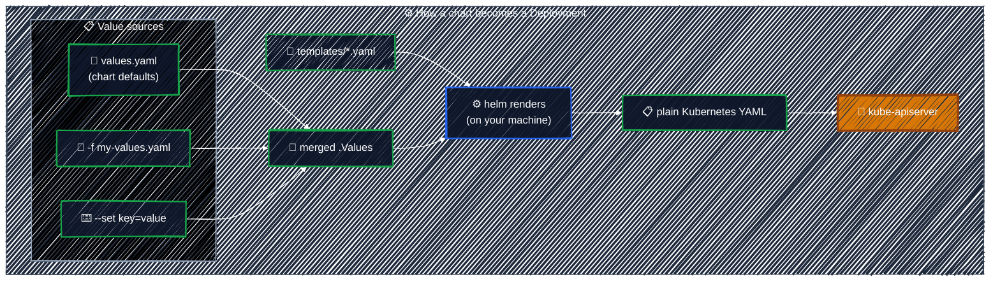
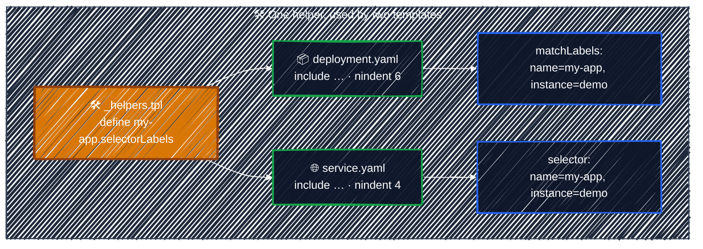
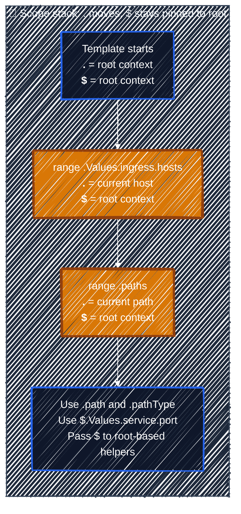
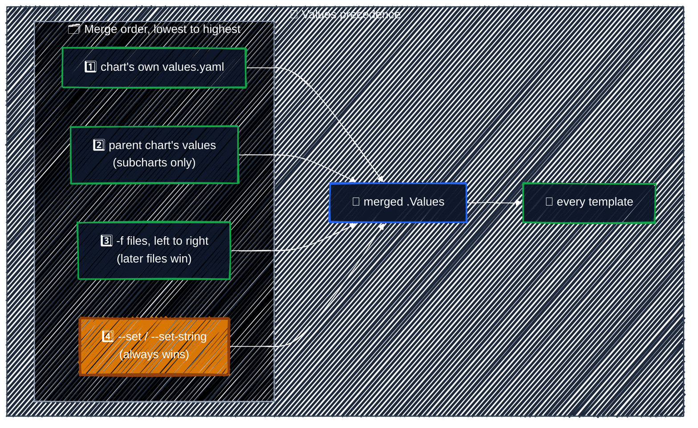
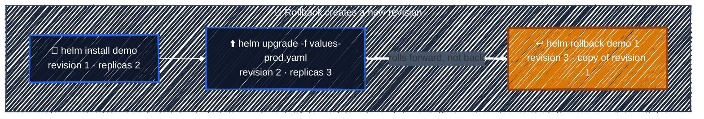
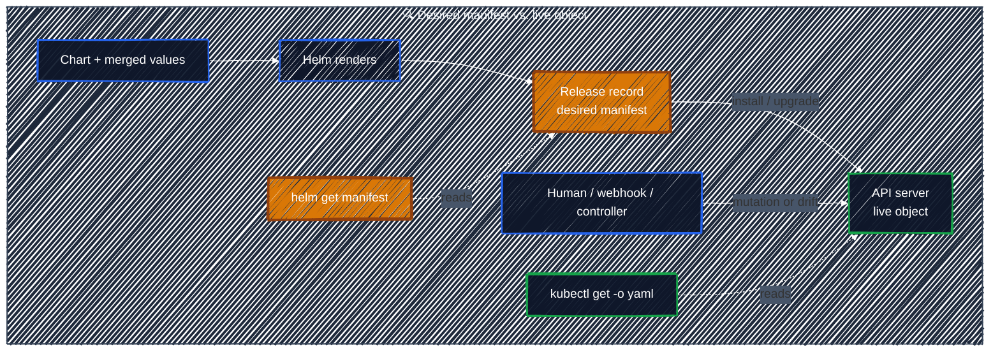
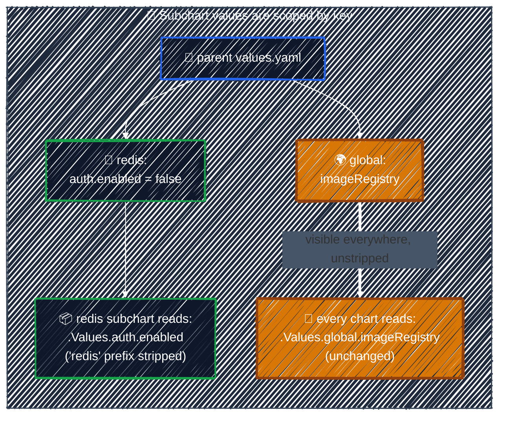

# Helm

> The package manager for Kubernetes — template your manifests, install them as one versioned unit, and learn to read the charts your team already has.

---

By now you have a pile of manifests — Deployment, Service, ConfigMap, Ingress — and for dev/staging/prod they're *almost* identical, differing by a replica count or an image tag. Copy-pasting and hand-editing that per environment is how mistakes happen. **Helm** is the package manager for Kubernetes: it **templates** your manifests and installs them as one versioned, upgradeable unit.

Most people meet Helm from the other direction, though: someone hands you a repository and says "the app is deployed by that chart." You open `templates/deployment.yaml` and instead of YAML you find this:

```yaml
metadata:
  name: {{ include "my-app.fullname" . }}
  labels:
    {{- include "my-app.labels" . | nindent 4 }}
```

That is the real goal of this chapter: **by the end you should be able to trace how an unfamiliar chart turns values into Kubernetes resources, and know how to investigate any helper or branch you do not recognize.** We build up to it with a small chart you can render and install yourself.

## How to read this chapter

It's a long one, so here's the map. Parts B and C — the chart-reading skill — need no cluster at all:

| Part | What you get | Cluster? |
|---|---|---|
| **A — Setup** | Helm installed, one release created and deleted | only for First run |
| **B — The model** | You can say what a chart *is* and what Helm does to it | no |
| **C — The syntax** | **The core skill: reading someone else's templates** | no |
| **D — Operating** | Install, upgrade, roll back, and audit real releases | only for Hands-on |

Section by section:

- **A — Setup:** [Before you start](#before-you-start) → [First run](#first-run)
- **B — The model:** [four nouns](#the-four-nouns) → [rendering](#how-rendering-actually-works) → [chart anatomy](#anatomy-of-a-chart) → [built-in objects](#the-objects-available-in-a-template)
- **C — The syntax:** [the five things](#the-five-things-that-trip-readers-up) → [two annotations](#two-annotations-worth-recognizing)
- **D — Operating:** [values](#where-values-come-from) → [releases](#releases-and-revisions) → [hands-on](#hands-on) → [third-party charts](#using-someone-elses-chart) → [subcharts](#subcharts-and-dependencies) → [checklist](#a-checklist-for-reading-an-unfamiliar-chart)

Do not try to absorb all 1,000+ lines in one sitting. Read it in passes:

| Pass | Read | Goal | Cluster? |
|---|---|---|---|
| **1 — Learn to read charts** | [Four nouns](#the-four-nouns) → [rendering](#how-rendering-actually-works) → [chart anatomy](#anatomy-of-a-chart) → [five syntax traps](#the-five-things-that-trip-readers-up) → [15-minute drill](#a-15-minute-chart-reading-drill) | Trace values, helpers, scopes, and rendered resources | no |
| **2 — Learn to operate releases** | [Values precedence](#where-values-come-from) → [revisions](#releases-and-revisions) → [hands-on](#hands-on) | Install, upgrade, inspect, and roll back safely | yes for hands-on |
| **3 — Use as reference** | [Larger-chart decoder](#a-compact-decoder-for-larger-charts) → [hooks](#two-annotations-worth-recognizing) → [third-party charts](#using-someone-elses-chart) → [subcharts](#subcharts-and-dependencies) | Decode advanced patterns when you encounter them | depends |

If your immediate goal is "read my team's chart," complete pass 1 first. It is intentionally cluster-free.

## Before you start

If you've never touched Helm, here's everything you need. Nothing in parts B and C needs a Kubernetes cluster, so if you're on a laptop without one, start anyway.

### 1. Install Helm

Unlike Kustomize (which is built into `kubectl`), Helm is a separate binary. It runs entirely on your machine and talks to the cluster through your normal kubeconfig — there is **no server-side component**, no Tiller, nothing to install into the cluster (that changed in Helm 3; old blog posts may tell you otherwise).

> **Version note:** This chapter and its commands target **Helm 3.x**. The chart format and core template language also apply to Helm 4, but some command flags changed — notably Helm 4 uses `--rollback-on-failure` where the Helm 3 examples below use `--atomic`. Check `helm version --short` before copying CI commands between projects.

```bash
curl -fsSL https://raw.githubusercontent.com/helm/helm/main/scripts/get-helm-3 | bash
helm version --short
```

Package managers work too (`brew install helm`, `apt-get install helm`, `choco install kubernetes-helm`), but may install the current major version rather than Helm 3. The script above installs a single binary into `/usr/local/bin`, escalating with `sudo` if it needs to — the same caveat the [README](../../README.md#prerequisites) makes about piping a remote script into a shell applies here, so read it first if that matters to you.

### 2. Get this repository

Every path in this chapter is relative to the repo root, so clone it and stay there:

```bash
git clone https://github.com/r97221004/k8s-tutorial.git
cd k8s-tutorial
helm lint manifests/packaging/helm/my-app     # your first Helm command — no cluster needed
```

If that prints `1 chart(s) linted, 0 chart(s) failed`, your setup is good enough for the whole first half.

### 3. A cluster, for the hands-on lab

Any cluster works — the [kubeadm one this guide builds](../getting-started/setup-kubeadm.md), or the k3s fast lane from the [README prerequisites](../../README.md#prerequisites). Verify with:

```bash
kubectl get nodes    # one node, STATUS Ready
helm list            # no releases yet — and, crucially, no error
```

That second command is the one beginners should run first. An empty result is success; `helm list` failing with `Error: Kubernetes cluster unreachable` is never a Helm problem — it means Helm couldn't use your kubeconfig, so fix `kubectl` first. A successful empty result only proves *some* cluster is reachable through your current context, not necessarily the one you meant to set up — see [a closer look at `helm list`](#a-closer-look-at-helm-list) if that distinction matters to you right now.

Two render modes are worth distinguishing:

- **`helm template`** renders locally and never installs anything. It is the clearest cluster-free tool for reading a chart.
- **`helm install --dry-run`** (or the explicit `--dry-run=client`) also works without a cluster. Use `--dry-run=server` when you intentionally want server-side validation and cluster-aware functions such as `lookup`; that mode requires cluster access.

### 4. The rest

- **Internet access** — to install Helm, to pull `nginx:1.27` from Docker Hub for the lab, and for `helm repo add` in [Using someone else's chart](#using-someone-elses-chart). Air-gapped? The render-only half still works.
- **bash or zsh** — a couple of examples use `diff <(…) <(…)` (process substitution), which `sh`/`dash` doesn't support.
- **Cluster headroom** — the lab peaks at 3 nginx replicas requesting 300m CPU / 384Mi total, comfortable inside the 2 vCPU / 4 GB single-node lab the README describes.
- **Optional:** [k9s](../getting-started/k9s.md) for the watch points below (`kubectl get -w` works too), and an Ingress controller *only* if you flip `ingress.enabled` on — the lab deliberately leaves it off.
- Everything installs into the **`default` namespace**, like the rest of this guide.

## First run

If you have a cluster, spend one minute here before any theory — having seen Helm *work* makes the rest read much faster. (No cluster? Skip to [The four nouns](#the-four-nouns); nothing below depends on this.)

Confirm the cluster is reachable before installing anything into it — the same two-command check from [step 3 above](#3-a-cluster-for-the-hands-on-lab). Skip it if you already ran it a moment ago; otherwise:

```bash
kubectl get nodes    # STATUS Ready — a node exists and is healthy enough to run Pods
helm list            # empty table, no error — Helm itself can reach the cluster
```

Run both, not just one — they check different things and each can pass while the other fails. `kubectl get nodes` says nothing about whether *Helm* has permission to do anything: listing nodes is cluster-scoped and often more openly permitted than listing the Secrets Helm stores release records in, so `kubectl get nodes` can succeed while `helm list` hits `Forbidden`. Conversely, `helm list` succeeding says nothing about node health — the apiserver and etcd can be fully reachable, so `helm list` returns cleanly, even while every node is `NotReady`; in that state `helm install` would still "succeed" at the API level, and the Pod would then sit at `Pending` forever with no healthy node to run it on. On this single-node lab, under one admin kubeconfig throughout, both checks always agree — that's specific to this setup, not a general guarantee. Proceeding here:

```bash
helm install demo manifests/packaging/helm/my-app
kubectl get deploy,svc,cm -l app.kubernetes.io/instance=demo
helm uninstall demo
```

One command created a Deployment, a Service *and* a ConfigMap; one command removed all three. That's the whole value proposition — a set of related objects managed as a single named thing.

**How did that reach the cluster at all?** The same way `kubectl apply` does: Helm read your **kubeconfig** — the exact file `kubectl` already uses — and talked to the same `kube-apiserver`. There is no separate Helm server or agent running inside the cluster. (Helm 2 had one, called Tiller; Helm 3 removed it, which is why installing Helm was just "download one binary," not "install something into every cluster you touch.") Concretely, `helm install` did two things, in order: it turned the chart's templates into plain Kubernetes YAML **on your laptop**, then applied that YAML the same way `kubectl apply -f` would have. [How rendering actually works](#how-rendering-actually-works) below covers this with a diagram — for now, the short version is: **Helm is a YAML generator bolted onto `kubectl`, not a separate system living in your cluster.**

One more thing probably looked odd, and it's answered later, so don't chase it now: the objects are called `demo-my-app` rather than `demo` — that's the [`fullname` helper](#3-_helperstpl-define-and-include).

### Commands you'll see throughout this chapter

Before the vocabulary, a quick anchor: every Helm command used anywhere in this chapter, in one place, with whether it needs a live cluster to run. Skim it once, then treat it as a lookup table — you are not expected to memorize it.

| Command | What it does | Needs a cluster? |
|---|---|---|
| `helm version --short` | Prints the Helm client version you have installed | No |
| `helm lint <chart>` | Checks a chart's templates for obvious mistakes before you render or install it | No |
| `helm template <name> <chart>` | Renders the chart locally to plain YAML. Nothing is installed; nothing but your own disk is touched | No |
| `helm show values <chart>` | Prints a chart's `values.yaml` — the knobs it exposes, with their defaults | No |
| `helm show chart <chart>` | Prints a chart's `Chart.yaml` — name, version, description | No |
| `helm repo add` / `update` / `search` | Registers a chart repository, refreshes its index, searches it. Needs internet, not a cluster | No |
| `helm list` (alias `helm ls`) | Lists releases **in your current namespace only**. Empty output is success, not failure — [details below](#a-closer-look-at-helm-list) | Yes |
| `helm status <release>` | Is this release healthy right now? What did its last operation do? | Yes |
| `helm install <name> <chart>` | Renders, then creates: install a brand-new release | Yes |
| `helm upgrade <name> <chart>` | Renders, then applies: change an existing release's values or chart version | Yes |
| `helm get manifest <release>` | The exact YAML this release last applied to the cluster | Yes |
| `helm get values <release>` | The values this release was installed or last upgraded with | Yes |
| `helm history <release>` | Every past revision of a release, oldest to newest | Yes |
| `helm rollback <release> <rev>` | Creates a **new** revision whose content copies an older one | Yes |
| `helm uninstall <release>` | Removes every object this release created | Yes |

Every one of these gets used and explained again in its own context later in the chapter — this table exists so you have somewhere to come back to, not so you absorb it right now.

#### A closer look at `helm list`

It is the command beginners misread most, so it earns its own explanation:

- **It lists Helm *releases*, not arbitrary cluster objects.** Anything created with plain `kubectl apply`, or by any tool other than Helm, never shows up here. `helm list` only knows about things it installed itself — internally tracked as Secrets carrying an `owner=helm` label.
- **It defaults to your current namespace only.** Add `-A` / `--all-namespaces` to check every namespace, or `-n <namespace>` for one specific namespace. `helm list` staying empty in `default` says nothing about `kube-system` or anywhere else.
- **It defaults to showing only `deployed` or `failed` releases.** Add `--all` to also see `uninstalled`, `superseded`, and in-progress ones.
- The columns in the default table are `NAME NAMESPACE REVISION UPDATED STATUS CHART APP VERSION` — one row per release, not per Kubernetes object.
- **An empty, error-free result proves exactly two things and no more:** your kubeconfig currently points at *some* reachable Kubernetes API, and nothing has been installed there via Helm in that namespace. It does **not** prove that cluster is the one you set up for this tutorial — a leftover `docker-desktop` context, an old k3s or minikube cluster still running in the background, or a stale context pointing at a shared or company cluster would all produce the exact same "empty, no error" result. If you're ever unsure which cluster you're actually talking to:

  ```bash
  kubectl config current-context     # the name of the context in use right now
  kubectl config view --minify       # that context's full detail: cluster, server URL, user
  ```

## The four nouns

[First run](#first-run) already used all four of these — this section just puts names on what you did:

```bash
helm install demo manifests/packaging/helm/my-app
```

- **Chart** — the thing you pointed at: `manifests/packaging/helm/my-app/`. A package of templated manifests plus default values, as a folder (or packaged into a `.tgz`). This is the reusable unit — one chart, installable as many times as you like. *Full tour: [Anatomy of a chart](#anatomy-of-a-chart).*
- **Values** — the knobs that fill in a chart's placeholders: the chart's own `values.yaml` (its defaults), plus anything you override with `-f`/`--set`. The `demo` install above used no `-f`, no `--set` — every setting came straight from `my-app/values.yaml` (`replicaCount: 2`, `image.repository: nginx`, …). *Full detail: [Reading `values.yaml`](#reading-valuesyaml) and [Where values come from](#where-values-come-from).*
- **Template** — not the `templates/` folder itself, but **one file inside it**. A chart has several: `deployment.yaml`, `service.yaml`, `configmap.yaml`, … — all living together in that one folder, which is why the folder name is plural. Each template is a manifest file written with `{{ }}` placeholders instead of hardcoded values — e.g. `replicas: {{ .Values.replicaCount }}` in `templates/deployment.yaml`. A template plus a set of values is what gets rendered into one ordinary Kubernetes manifest. *Full detail: [How rendering actually works](#how-rendering-actually-works), next, then [the five things that trip readers up](#the-five-things-that-trip-readers-up) — the longest section in this chapter, and the one that teaches the actual skill.*
- **Release** — the name you gave *this particular installation*: `demo`. One chart, installed into a cluster, under a name, with its own revision history. Run `helm install demo2 manifests/packaging/helm/my-app` and you'd get a second, completely independent release of the *same* chart — two `Deployment`s, two `Service`s, tracked separately. *Full detail: [Releases and revisions](#releases-and-revisions).*

Put the four together and that's the whole model: **install a Chart, with some Values, whose Templates render into manifests, as a named Release.** One chart, many releases with different values, is how the same app runs unmodified across every environment — no copy-pasted YAML.

## How rendering actually works

This is the single most useful mental model, and it clears up most confusion: **the cluster never sees a template.** Helm renders templates to plain YAML on your machine, then sends that YAML to the apiserver — the same YAML `kubectl apply` would have sent.



Two consequences worth internalizing:

- **`helm template` shows the locally rendered result.** Any time a chart confuses you, render it and read the output instead of mentally simulating indentation and branches.
- **The apiserver cannot help you debug a template.** A typo inside `{{ }}` is a Helm-side error you'll see locally, before anything reaches the cluster.

For most application charts — including both charts in this tutorial — that local output is exactly what a real install would produce. But `helm template` has no real cluster to ask, so for two specific kinds of question it has to guess:

- **"What Kubernetes version is this?"** A template can check with `.Capabilities.KubeVersion` — e.g. to use a newer API only on new-enough clusters. Neither tutorial chart does this, so there's no real path to point `helm template` at here — but you don't need one to see the effect. This is `<chart>` standing in for *any* chart with a template containing this one line:

  ```yaml
  kubeVersion: {{ .Capabilities.KubeVersion.Version }}
  ```

  Render it with no cluster at all, and Helm answers from a version number baked into the Helm binary itself:

  ```bash
  helm template demo <chart>
  # kubeVersion: v1.31.0    ← Helm's own built-in guess, on this machine's Helm install
  ```

  Add one flag, still with no cluster, and the *exact same template* renders differently:

  ```bash
  helm template demo <chart> --kube-version 1.20.0
  # kubeVersion: v1.20.0    ← same template, a different assumed answer
  ```

  Neither run touched a real cluster — the second one just told Helm to guess something else.
- **"Does this API — or this object — exist?"** `.Capabilities.APIVersions.Has "apps/v1"` checks whether an API group is available; `lookup "v1" "Secret" ns name` reads a live object. With no cluster, Helm answers API-availability questions from a fixed built-in list of well-known stable APIs — `apps/v1` reads as available even with no cluster at all — but a CRD your *real* cluster has installed, which isn't on that built-in list, reads as unavailable locally even though it would work during a real install. `lookup` has no fallback list whatsoever: with no cluster to query, it always returns empty, regardless of whether the object actually exists on the target cluster.

Neither of this tutorial's charts branches on `.Capabilities` or calls `lookup`, so none of this affects anything you've run so far — it only matters for charts that do. When it does matter: `--kube-version` / `--api-versions` let you tell `helm template` what to assume, still with no cluster; `--dry-run=server` skips guessing entirely and asks the target cluster directly.

## Anatomy of a chart

`helm create` scaffolds a chart, and nearly every chart you meet follows its shape. This guide ships a small but realistic one at [`manifests/packaging/helm/my-app/`](../../manifests/packaging/helm/my-app/):

```
manifests/packaging/helm/
├── values-prod.yaml         # a per-environment override — deliberately OUTSIDE the chart
└── my-app/                  # ← the chart is this directory
    ├── Chart.yaml           # the chart's identity and version
    ├── values.yaml          # default values — the chart's public API
    ├── .helmignore          # what to leave out when packaging a .tgz
    └── templates/
        ├── _helpers.tpl     # reusable snippets — underscore = not a manifest
        ├── deployment.yaml
        ├── service.yaml
        ├── configmap.yaml
        ├── ingress.yaml     # rendered only when ingress.enabled is true
        └── NOTES.txt        # the message printed after `helm install`
```

`values-prod.yaml` sits *outside* `my-app/` on purpose, and it's worth understanding why before you copy the layout: `helm package` bundles **everything inside the chart directory** into the `.tgz`. Put your production values in there and they ship to everyone who installs the chart. The chart is the artifact you distribute; your per-environment values are your own deployment config, so they live next to it, not in it.

Using it doesn't mean moving it in, either. At install/upgrade time you pass it with `-f`, and Helm merges the two files **in memory, at that moment** — `values.yaml` is never edited, overwritten, or replaced on disk, and `values-prod.yaml` never gets copied into the chart directory. Run the exact same `-f` command a hundred times and `values.yaml` stays byte-for-byte identical every single time; only the *rendered output* changes. [Where values come from](#where-values-come-from) covers the full merge order.

| File | What it's for |
|---|---|
| `Chart.yaml` | Name, `version` (the chart's version), `appVersion` (the app inside it), and `dependencies` (subcharts) |
| `values.yaml` | **Read this first.** Every knob the chart author intended you to turn, with defaults |
| `templates/*.yaml` | Manifests with `{{ }}` placeholders. One file per resource, by convention |
| `templates/_helpers.tpl` | Named snippets shared by the other templates. Files starting with `_` are never rendered as manifests |
| `templates/NOTES.txt` | Printed after install/upgrade. Templated like everything else — usually "here's how to reach your app" |
| `charts/` | Subcharts, vendored in as `.tgz` (absent here — see [Subcharts](#subcharts-and-dependencies)) |
| `Chart.lock` | Resolved subchart versions, like `package-lock.json` (absent here) |

The two things beginners misread: `templates/` is not only for `kind:` resources (`_helpers.tpl` and `NOTES.txt` live there too), and `version` vs `appVersion` are different — bumping your chart's templates bumps `version`, shipping a new app image bumps `appVersion`.

### Reading `values.yaml`

`values.yaml` is **plain YAML — no `{{ }}`, no Helm-specific syntax.** If you can read any other Kubernetes manifest, you can already read this file; the only new skill is translating its *nesting* into the *dot-paths* templates use to reach it. Here's the top of the tutorial chart's own `values.yaml`:

```yaml
replicaCount: 2

image:
  repository: nginx
  tag: ""
  pullPolicy: IfNotPresent

# ...
service:
  type: ClusterIP
  port: 80
```

Indentation is nesting, same as any YAML: `repository` is a **key inside** `image`, not a sibling of it; `port` is a key inside `service`. A template reaches those values by chaining the same names onto `.Values` with dots, in the same order they're indented:

```
image:               →   .Values.image
  repository: nginx  →   .Values.image.repository

service:             →   .Values.service
  port: 80           →   .Values.service.port
```

So `.Values.image.repository` in a template and `image: / repository:` in `values.yaml` are the *same* value, just written two different ways — one as a path for Go's template language, one as nested YAML for a human to edit. This is why you'll see charts casually write "set `image.repository`" in prose or in a table: that dotted string is just shorthand for "open `values.yaml`, find `image:`, then `repository:` underneath it." The same reading applies to `--set image.repository=foo` on the command line — same dots, same nesting, just typed on one line instead of indented across several.

Larger charts often add a few more entries. You do not need them to understand this tutorial chart, but recognize them when you open a teammate's:

| Entry | What it means |
|---|---|
| `values.schema.json` | A JSON Schema that validates values before rendering and can document accepted types |
| `crds/` | CustomResourceDefinitions installed before templates; Helm does not upgrade or delete them like ordinary release resources |
| `templates/tests/` | Usually Pods or Jobs with a `helm.sh/hook: test` annotation, run explicitly with `helm test` |
| `type: library` in `Chart.yaml` | A helper-only chart meant to be imported by other charts, not installed by itself |

When inventorying a chart, inspect both `templates/` **and** `crds/`; `ls templates/` alone cannot tell you every object Helm may create.

## The objects available in a template

Inside `{{ }}`, `.` is the **root context** — an object with everything Helm knows. When you see a value appear out of nowhere in a chart, it came from one of these:

| Object | Contains | Example |
|---|---|---|
| `.Values` | The merged values (defaults + your overrides) | `.Values.replicaCount` |
| `.Release` | Facts about *this installation* | `.Release.Name`, `.Release.Namespace`, `.Release.Revision`, `.Release.Service` |
| `.Chart` | The contents of `Chart.yaml` | `.Chart.Name`, `.Chart.Version`, `.Chart.AppVersion` |
| `.Capabilities` | What the target cluster supports | `.Capabilities.KubeVersion.Minor` |
| `.Files` | Non-template files in the chart, for embedding | `.Files.Get "config/nginx.conf"` |
| `.Template` | The file currently being rendered | `.Template.BasePath`, `.Template.Name` |

Note the capital letters — `.values` will not work. And `.Release.Name` is chosen at install time (`helm install demo ./my-app` → `demo`), which is why chart authors use it to name objects: two releases of one chart must not collide.

## The five things that trip readers up

This is the longest section in the chapter and the one that actually buys you the skill. Start with this table — it's enough to make sense of most charts today — then read the five sub-sections for the *why*.

| # | What you'll see | What it means |
|---|---|---|
| 1 | `{{- … -}}` | Chomps the whitespace around the tag. Punctuation, not logic — read past it |
| 2 | `toYaml . \| nindent 8` | Paste this values block in, indented 8 spaces |
| 3 | `include "my-app.labels" .` | Insert a named snippet defined in `_helpers.tpl` (the trailing `.` passes the context) |
| 4 | `if` / `with` / `range` | Conditional / scope-shift / loop. **Inside `with` and `range`, `.` changes meaning — `$` is always the root** |
| 5 | `default` / `quote` / `required` | Fall back to a value / wrap in quotes / fail with a message |

If you remember only one line of it, make it the `$` note in row 4 — that's the one that makes people misread charts.

Everything below is in [`manifests/packaging/helm/my-app/`](../../manifests/packaging/helm/my-app/), so you can render each one and see the result.

### 1. `{{-` and `-}}` — whitespace control

A `{{ if }}` on its own line still leaves that line's whitespace and newline in the output. YAML cares about whitespace, so charts are littered with `-` to chomp it: `{{-` removes whitespace *before* the tag, `-}}` removes it *after*.

| Written | Meaning |
|---|---|
| `{{ .Values.x }}` | Substitute, touch no surrounding whitespace |
| `{{- .Values.x }}` | Delete whitespace and newlines **before** the tag |
| `{{ .Values.x -}}` | Delete whitespace and newlines **after** the tag |
| `{{- if … }}` | The control line itself leaves no blank line behind |

Without chomping:

```yaml
metadata:
  {{ if .Values.enabled }}
  key: value
  {{ end }}
```

```yaml
metadata:
  
  key: value
```

That stray indented blank line is harmless here but is the classic cause of "YAML parse error" once it lands somewhere structure-sensitive. With `{{-`:

```yaml
metadata:
  {{- if .Values.enabled }}
  key: value
  {{- end }}
```

```yaml
metadata:
  key: value
```

Rule of thumb when reading: **`-` is punctuation, not logic.** It never changes *which* values get emitted, only the whitespace around them — so when you're working out what a chart produces, read past it. (Whitespace is not nothing in YAML, which is exactly why chart authors are so fussy about it.)

Comments follow the same idea. A `#` comment is ordinary YAML and survives into the rendered output; `{{/* … */}}` is a *template* comment and disappears. The chart's templates use `{{- /* … */}}` so the explanatory notes never show up in what gets applied.

### 2. `toYaml` and `nindent` — indentation as a function call

A chart often wants to drop a whole block of user-supplied YAML into a manifest. `toYaml` converts a values object back into YAML text, and `nindent N` adds a newline and indents every line by N spaces:

```yaml
          {{- with .Values.resources }}
          resources:
            {{- toYaml . | nindent 12 }}
          {{- end }}
```

Given `values.yaml`:

```yaml
resources:
  requests:
    cpu: 50m
```

that renders as:

```yaml
          resources:
            requests:
              cpu: 50m
```

`indent` and `nindent` differ by exactly one newline: `nindent` = newline + `indent`. That's why you see `{{- toYaml . | nindent 4 }}` right after a `key:` on the previous line — the `{{-` eats the newline, and `nindent` puts back a newline plus correct indentation. Getting the number wrong is the most common way to break a chart, and it shows up immediately in `helm template`.

One thing that looks like a bug the first time: **`toYaml` sorts map keys alphabetically.** Our `values.yaml` lists `requests` before `limits`, but the rendered Deployment shows `limits` first. Nothing is wrong — YAML mappings are unordered, and `toYaml` just picks a deterministic order. Don't waste time hunting for the code that reordered it.

### 3. `_helpers.tpl`, `define`, and `include`

Real charts almost never write `name:` directly. They define a snippet once and pull it in everywhere. Our chart's `_helpers.tpl` defines five, and between them they account for nearly every `{{ }}` in the other templates — so when a chart's `metadata:` looks like nothing but `include` calls, this file is what you read:

| Helper | Produces |
|---|---|
| `my-app.name` | The chart's short name (`my-app`), or `nameOverride` if set |
| `my-app.fullname` | The name every object gets (`demo-my-app`) — dissected further down |
| `my-app.chart` | `name-version` (`my-app-0.2.0`), for the `helm.sh/chart` label |
| `my-app.labels` | The full label set for every object, including the selector labels |
| `my-app.selectorLabels` | Just the labels a selector matches on |

Here's one of them, and how a template pulls it in:

```yaml
{{/* in templates/_helpers.tpl */}}
{{- define "my-app.selectorLabels" -}}
app.kubernetes.io/name: {{ include "my-app.name" . }}
app.kubernetes.io/instance: {{ .Release.Name }}
{{- end }}
```

```yaml
{{/* in templates/deployment.yaml */}}
  selector:
    matchLabels:
      {{- include "my-app.selectorLabels" . | nindent 6 }}
```



This isn't style for its own sake. As [Labels & Selectors](../core-objects/labels-selectors.md) explained, nothing here is wired by reference — the Deployment's `matchLabels`, the Pod template's `labels`, and the Service's `selector` all have to agree on the Pod's labels for any of it to connect. That's the same set of labels written in three places across two files, and a Deployment's `selector` is **immutable** after creation, so getting it wrong means deleting and recreating. One helper emitting all three makes them impossible to drift.

Three details to know when reading:

- **The `.` at the end matters.** `include "name" .` passes the current context to the snippet. Passing `nil` or the wrong scoped context can make root objects such as `.Values` unavailable inside it. Inside a `range` or `with`, chart authors write `include "name" $` when the helper expects the root context (see below).
- **`include` vs `template`.** Both call a snippet; only `include` returns a *string*, so only `include` can be piped into `nindent`. `{{ template "x" . }}` cannot be indented, which is why modern charts use `include` almost exclusively.
- **Names are global and namespaced by convention.** Every `define` in every chart *and subchart* shares one namespace, hence the `my-app.` prefix.

The `fullname` helper is worth reading in full, because it explains the object names you'll see in the cluster:

```yaml
{{- define "my-app.fullname" -}}
{{- if .Values.fullnameOverride }}
{{- .Values.fullnameOverride | trunc 63 | trimSuffix "-" }}
{{- else }}
{{- $name := default .Chart.Name .Values.nameOverride }}
{{- if contains $name .Release.Name }}
{{- .Release.Name | trunc 63 | trimSuffix "-" }}
{{- else }}
{{- printf "%s-%s" .Release.Name $name | trunc 63 | trimSuffix "-" }}
{{- end }}
{{- end }}
{{- end }}
```

Read it as a chain of fallbacks: an explicit `fullnameOverride` wins; otherwise it's `<release>-<chart>`; unless the release name already contains the chart name, in which case don't stutter. `trunc 63` exists because Kubernetes names used as DNS labels max out at 63 characters, and `trimSuffix "-"` cleans up a truncation that lands on a hyphen. So:

| Command | Objects named |
|---|---|
| `helm install demo ./my-app` | `demo-my-app` |
| `helm install my-app ./my-app` | `my-app` (no stutter) |
| `helm install demo ./my-app --set fullnameOverride=custom` | `custom` |

This is why `kubectl get deploy` after a Helm install rarely shows the name you typed.

### 4. `if`, `with`, and `range`

**`if`** guards whole resources. `templates/ingress.yaml` wraps its entire body so that nothing is emitted unless you ask for it:

```yaml
{{- if .Values.ingress.enabled }}
apiVersion: networking.k8s.io/v1
kind: Ingress
# …
{{- end }}
```

Helm treats `false`, `0`, `""`, an empty list/map, and `nil` as false — everything else is true.

**`with`** does two jobs at once: skip the block if the value is empty, *and* rebind `.` to that value inside it.

```yaml
      {{- with .Values.nodeSelector }}
      nodeSelector:
        {{- toYaml . | nindent 8 }}
      {{- end }}
```

Inside that block `.` is `.Values.nodeSelector`, not the root — which is the number-one gotcha in reading charts. If you need the root inside a `with` or `range`, use **`$`**, which always refers to it.

**`range`** iterates. Over a map you get key and value; over a list you get each item:

```yaml
data:
  {{- range $key, $value := .Values.config }}
  {{ $key }}: {{ $value | quote }}
  {{- end }}
```

```yaml
data:
  GREETING: "hello from values.yaml"
  LOG_LEVEL: "info"
```

And here is `$` in action, from `templates/ingress.yaml` — inside two nested `range`s, `.` is the current path entry, so the root has to be reached explicitly:

```yaml
              service:
                name: {{ include "my-app.fullname" $ }}
                port:
                  number: {{ $.Values.service.port }}
```

Visualize the scope as a stack. `$` stays pinned to the root while `.` follows the current block:



| Location | `.` means | How to reach root |
|---|---|---|
| At template entry | Helm's full root context | `.` or `$` |
| Inside `with .Values.nodeSelector` | The `nodeSelector` map | `$` |
| Inside `range .Values.ingress.hosts` | The current host item | `$` |
| Inside the nested `range .paths` | The current path item | `$` |

### 5. The functions you'll see constantly

Helm ships the [Sprig](https://masterminds.github.io/sprig/) function library. You don't need to memorize it, but these show up in nearly every chart:

| Function | Does | Typical use |
|---|---|---|
| `default` | Falls back when the value is empty | `.Values.image.tag \| default .Chart.AppVersion` |
| `quote` | Wraps in double quotes | `{{ $value \| quote }}` — keeps `true`/`123` from becoming a bool/int |
| `required` | Fails the render with your message | `required "image.tag must be set" .Values.image.tag` |
| `toYaml` | Object → YAML text | pairing with `nindent` (above) |
| `nindent` / `indent` | Newline + indent / indent | inserting blocks at the right depth |
| `printf` | Format a string | `printf "%s-%s" .Release.Name $name` |
| `sha256sum` | Hash a string | the `checksum/config` annotation (below) |
| `b64enc` | Base64-encode | Secret `data:` values |
| `tpl` | Render a *value* as a template | letting users put `{{ }}` inside their own values |
| `trunc` / `trimSuffix` | Cut to length / strip a suffix | the 63-character name limit |

The pipe sends the value on its left as the **last argument** to the function on its right. These pairs are equivalent:

```gotemplate
{{ quote .Values.config.GREETING }}
{{ .Values.config.GREETING | quote }}

{{ default .Chart.AppVersion .Values.image.tag }}
{{ .Values.image.tag | default .Chart.AppVersion }}
```

Read a longer pipeline from left to right:

```gotemplate
{{ include "my-app.labels" . | nindent 4 }}
```

1. Call the helper with the current context.
2. Take the returned string.
3. Add a newline and indent it four spaces.

Parentheses evaluate first. In the checksum expression, `print` builds a filename, `include` renders that file, then the pipe sends the rendered string to `sha256sum`.

`required` is the polite way a chart demands input. Swap `default .Chart.AppVersion` for `required "image.tag must be set"` in `deployment.yaml`, leave `image.tag` empty, and the render stops with a message you can act on:

```
Error: execution error at (my-app/templates/deployment.yaml:26:52): image.tag must be set
```

Compare that to what you get when a chart *doesn't* validate and a whole section of values is absent — delete the `image:` block from `values.yaml` and render:

```
Error: template: my-app/templates/deployment.yaml:26:28: executing "my-app/templates/deployment.yaml" at <.Values.image.repository>: nil pointer evaluating interface {}.repository
```

`nil pointer evaluating interface {}.<key>` always means the same thing: **a parent key in the path doesn't exist.** Here `.Values.image` itself is missing, so there is nothing to look `repository` up on — the error names the child, but the missing thing is the parent. Note that `required` cannot rescue you from this: it checks the final value, so the nil dereference happens first.

### A compact decoder for larger charts

The tutorial chart deliberately keeps its expressions small. Team charts often compress more work into one line; decode the pieces rather than trying to read the whole expression at once:

| Pattern | Read it as |
|---|---|
| `{{- $name := ... }}` | Calculate something once and store it in the variable `$name` |
| `eq`, `ne`, `and`, `or`, `not` | Comparison and boolean logic, usually inside `if` |
| `dict "value" .Values.foo "context" $` | Build a map with keys `value` and `context`, often to pass several arguments to a helper |
| `list`, `append`, `concat` | Build or combine lists |
| `hasKey`, `dig`, `coalesce` | Safely inspect nested or optional values |
| `merge`, `mergeOverwrite`, `deepCopy` | Combine maps; check which side wins before trusting the result |
| `semverCompare` | Choose YAML according to a Kubernetes or application version |
| `.Capabilities.APIVersions.Has "group/v1/Kind"` | Emit a resource only when that API exists |
| `lookup "v1" "Secret" .Release.Namespace "name"` | Read a live cluster object while rendering |

For example:

```gotemplate
{{- $ctx := dict "value" .Values.podLabels "context" $ -}}
{{- include "company.tplvalues.render" $ctx | nindent 8 }}
```

Read it as: make an argument object containing the user's labels and the root context, pass it to a company helper, then indent the returned YAML. The helper name is not built into Helm — search for its `define`, including in library subcharts:

```bash
grep -R -n 'define "company\.tplvalues\.render"' .
```

Two rules keep this manageable:

- When you see `include`, find the matching `define` before guessing what it returns.
- When you see `lookup` or `.Capabilities`, local rendering may not match the target cluster; inspect both branches and render with the appropriate cluster capabilities.

## Two annotations worth recognizing

**`checksum/config`** solves a problem you already hit in [ConfigMaps](../config-and-data/configmap.md): editing a ConfigMap does not restart the Pods that read it, so you had to run `kubectl rollout restart` by hand. Charts automate that — they hash the rendered ConfigMap into the Pod template, so a changed value changes the Pod spec, and the Deployment rolls on its own:

```yaml
      annotations:
        checksum/config: {{ include (print $.Template.BasePath "/configmap.yaml") . | sha256sum }}
```

Read it inside-out: `$.Template.BasePath` is the chart's `templates/` directory, `include` renders that file to a string, `sha256sum` hashes it. Change `config.GREETING` and the annotation changes with it.

**`helm.sh/hook`** marks a resource as a lifecycle hook rather than part of the app — most often a Job that runs a database migration before the new version starts:

```yaml
  annotations:
    helm.sh/hook: pre-upgrade
    helm.sh/hook-weight: "0"
    helm.sh/hook-delete-policy: before-hook-creation
```

Hooked resources are applied at their phase (`pre-install`, `post-install`, `pre-upgrade`, `pre-delete`, …), ordered by weight, and are **not** managed as part of the release afterwards. If you find a Job in a chart that seems to run out of band, check its annotations.

## Where values come from

Every override lands in the same merged `.Values` object, with a fixed priority:



Merging is **per key, recursively** — `-f values-prod.yaml` that sets only `replicaCount` leaves every other default intact. The exception is lists: a list is replaced wholesale, never merged element-wise.

Three commands answer "what values are in play":

```bash
helm show values manifests/packaging/helm/my-app   # the chart's documented defaults
helm get values demo                               # only the overrides you supplied
helm get values demo --all                         # everything, defaults included
```

For a third-party chart, `helm show values` is where you should always start — it's the chart's API documentation.

## Releases and revisions

Every successful `install`/`upgrade`/`rollback` creates a new **revision**. This includes rollbacks, which roll *forward* to a new revision containing old content:



Note the last box: rolling back to revision 1 does not *return* to revision 1, it creates revision **3** whose content is a copy of revision 1. You can roll back that rollback while the older revision is still retained. Helm limits retained history (Helm 3 upgrades default to 10 revisions), so old revisions can eventually be pruned. That's exactly the three-revision sequence you'll run in [Hands-on](#hands-on) below.

That history is not stored in Helm's own database — it lives in the cluster, as one Secret per revision in the release's namespace:

```bash
kubectl get secret -l owner=helm
# sh.helm.release.v1.demo.v1, sh.helm.release.v1.demo.v2, …
```

Which is why `helm list` only shows releases in the current namespace, and why deleting those Secrets by hand orphans a release.

The flags that matter in practice:

| Flag | Effect |
|---|---|
| `--install` (on `upgrade`) | Install if the release doesn't exist yet — makes CI idempotent |
| `--wait` | Don't report success until the resources are actually ready |
| `--atomic` | Helm 3: roll back automatically if the upgrade fails (implies `--wait`) |
| `--dry-run` | Render and validate without applying |
| `--version` | Pin the chart version (always do this for third-party charts) |

For Helm 3, `helm upgrade --install --atomic --wait` is a common CI incantation. Helm 4 renamed the failure-handling flag to `--rollback-on-failure`; keep the command in your repository aligned with the Helm major version used by CI.

## Hands-on

> **This is where a cluster becomes necessary** — see [Before you start](#before-you-start). The first two commands still work without one.

Render before you install, so you see the final YAML rather than trusting the templates:

```bash
helm lint manifests/packaging/helm/my-app
helm template demo manifests/packaging/helm/my-app
```

Note the names in the output — `demo-my-app`, from the `fullname` helper — and the labels the `my-app.labels` helper produced:

```yaml
metadata:
  name: demo-my-app
  labels:
    helm.sh/chart: my-app-0.2.0
    app.kubernetes.io/name: my-app
    app.kubernetes.io/instance: demo
    app.kubernetes.io/version: "1.27"
    app.kubernetes.io/managed-by: Helm
```

Now install it. `NOTES.txt` prints at the end:

```bash
helm install demo manifests/packaging/helm/my-app
```

```
my-app 1.27 is installed as release "demo".

  Revision: 1
  Replicas: 2

See what was created:

  kubectl get deploy,svc,cm -l app.kubernetes.io/instance=demo
...
```

That text comes from `templates/NOTES.txt`, rendered with the same context as everything else — which is why it can tell you your own release name and replica count.

```bash
helm list
kubectl get deploy,svc,cm -l app.kubernetes.io/instance=demo
```

The `app.kubernetes.io/instance` label is how you find everything belonging to one release — a habit worth keeping. In [k9s](../getting-started/k9s.md), `:deploy` ⏎ shows `demo-my-app` at `2/2`; leave it open for the next step.

Confirm the ConfigMap really reached the container as environment variables. The chart's Deployment pulls the whole ConfigMap in with `envFrom`, exactly as [Env Vars & Mounts](../config-and-data/env-and-mounts.md) covered — the only new thing here is that Helm generated both the ConfigMap and the reference to it:

```bash
kubectl exec deploy/demo-my-app -- printenv GREETING LOG_LEVEL
```

Now upgrade with a per-environment values file — the `-f` pattern that replaces hand-editing:

```bash
helm upgrade demo manifests/packaging/helm/my-app \
  -f manifests/packaging/helm/values-prod.yaml
helm history demo
```

Three things changed at once, and they're worth watching in k9s rather than polling: `:deploy` ⏎ shows `READY` climb from `2/2` to `3/3`, and `:pods` ⏎ shows **all** the Pods being replaced — not just the one new replica. That's `checksum/config` doing its job: `values-prod.yaml` changes `config.GREETING`, which changes the ConfigMap, which changes the checksum annotation in the Pod template, which rolls every Pod. Press `d` on the Deployment to see the new annotation value.

```bash
kubectl exec deploy/demo-my-app -- printenv GREETING   # now "hello from values-prod.yaml"
```

Compare what you asked for against what is actually deployed:

```bash
helm get values demo        # just the prod overrides
helm get manifest demo      # the manifest stored for the current Helm revision
```

`helm get manifest` is Helm's **desired release manifest**, not a fresh export of live objects. A person, admission webhook, or controller may have changed the live object after Helm applied it. When someone asks "what is actually running?", compare both views:



| Question | Command | What it reads |
|---|---|---|
| What would this chart render locally? | `helm template` | Local chart files and supplied values |
| What did the current release revision generate? | `helm get manifest` | Helm's stored release record |
| What does Kubernetes hold now? | `kubectl get … -o yaml` | The live API object |

```bash
helm get manifest demo > /tmp/demo-desired.yaml
kubectl get deployment demo-my-app -o yaml > /tmp/demo-live-deployment.yaml
```

The first answers "what did this Helm revision generate?"; the second answers "what does the apiserver hold now?" The live export also contains status and server-added metadata, so a raw `diff` will be noisy — use it to investigate a suspected field, or use the `helm diff` plugin for a release-aware comparison.

Then undo it:

```bash
helm rollback demo 1
helm history demo           # revision 3 — a new revision holding revision 1's content
kubectl exec deploy/demo-my-app -- printenv GREETING   # back to "hello from values.yaml"
```

Finally, see how `if` gates a whole resource. Nothing was created for the Ingress until now, because `ingress.enabled` defaults to `false`:

```bash
helm template demo manifests/packaging/helm/my-app | grep -c "kind: Ingress"            # 0
helm template demo manifests/packaging/helm/my-app --set ingress.enabled=true \
  | grep -c "kind: Ingress"                                                             # 1
```

Rendering it is safe; actually installing it needs an Ingress controller — see [Ingress](../networking/ingress.md).

Clean up:

```bash
helm uninstall demo
kubectl get deploy,svc,cm -l app.kubernetes.io/instance=demo   # nothing
helm list                                                      # no releases
```

Check the same three kinds you created, not `kubectl get all` — despite the name, `all` covers workloads and Services but **not** ConfigMaps or Secrets, so it would report a clean namespace while a ConfigMap was still sitting there.

For this tutorial chart, `helm uninstall` removes all three tracked resources. More generally, it removes resources Helm tracks as part of the release; hook resources, objects annotated with `helm.sh/resource-policy: keep`, CRDs, or resources whose ownership changed can remain. That tracking is still a real advantage over running `kubectl delete -f` across an arbitrary directory.

## Using someone else's chart

Installing third-party software is where Helm pays for itself. The workflow is: add the repo, read the values, pin a version, install.

```bash
helm repo add ingress-nginx https://kubernetes.github.io/ingress-nginx
helm repo update
helm search repo ingress-nginx --versions | head
helm show chart ingress-nginx/ingress-nginx
helm show values ingress-nginx/ingress-nginx | head -40
```

Every command above is read-only, so run them freely. Linger on `helm show values` — for a large chart that output runs to hundreds of lines, and it is the only documentation guaranteed to match the version you're installing. Find the handful of keys you need and put them in a values file.

Select the newest version from the search result into a shell variable, print it so it is visible in logs, and use that exact version for the install:

```bash
CHART_VERSION=$(helm search repo ingress-nginx/ingress-nginx --versions \
  | awk 'NR == 2 { print $2 }')
echo "Installing ingress-nginx chart ${CHART_VERSION}"

helm install ingress-nginx ingress-nginx/ingress-nginx \
  --namespace ingress-nginx --create-namespace \
  --version "$CHART_VERSION" \
  -f my-ingress-values.yaml
```

For reproducible automation, commit that resolved version to your deployment configuration rather than recalculating "newest" on every CI run.

Don't run that last one if you already installed a controller in the [Ingress](../networking/ingress.md) chapter — it's here to show the shape of a real third-party install, not as a step in this lab.

Added repos are a local setting, cached in your Helm config and not in the cluster. Drop it again when you're done exploring:

```bash
helm repo list
helm repo remove ingress-nginx
```

## Subcharts and dependencies

A chart can depend on other charts — an app chart that brings its own Redis, for example. Dependencies are declared in `Chart.yaml`:

```yaml
dependencies:
  - name: redis
    version: "20.x.x"
    repository: https://charts.bitnami.com/bitnami
    condition: redis.enabled
```

```bash
helm dependency update manifests/packaging/helm/my-app   # fetches into charts/, writes Chart.lock
```

Our chart keeps that block commented out so it stays installable offline, so the command above succeeds silently and does nothing — uncomment the `dependencies:` in `Chart.yaml` first if you want to watch it actually pull a subchart down.

`repository:` can also point at an OCI registry (`oci://…`), which is how a growing number of projects publish charts. `condition: redis.enabled` lets a user switch the whole subchart off. The part that confuses everyone is **values scoping**: a subchart only sees the values under its own key, with its own key stripped off.



So to set the Redis subchart's `auth.enabled`, the parent writes `redis.auth.enabled` — and the subchart's own templates still say `.Values.auth.enabled`. The `global:` key is the exception: it is visible, unchanged, to the parent and every subchart.

When you're reading a chart and a value seems to go nowhere, check whether it's addressed at a subchart.

## A checklist for reading an unfamiliar chart

In order, this gets you oriented in a few minutes:

| Step | Command / file | What you learn |
|---|---|---|
| 1 | `Chart.yaml` | What it is, its version, and whether it drags in subcharts |
| 2 | `values.yaml` + `values.schema.json` | The knobs, defaults, accepted types, and required input |
| 3 | `templates/` + `crds/` | Which resources and lifecycle behavior may exist |
| 4 | `templates/_helpers.tpl` + library dependencies | The naming, labelling, and shared rendering scheme |
| 5 | `helm template <name> <chart>` | The locally rendered YAML with chart defaults |
| 6 | `helm template … -f their-values.yaml` | What your team's values render locally |
| 7 | `helm get manifest <release>` | The desired manifest stored in the current release revision |
| 8 | `helm get values <release> --all` | Which computed values that release used |
| 9 | `kubectl get … -o yaml` | The live object, including drift and server-added fields |

When a template still doesn't make sense, don't read harder — change a value and re-render. Diffing two `helm template` outputs answers "what does this knob do?" faster than any amount of squinting:

```bash
C=manifests/packaging/helm/my-app
diff <(helm template demo $C) <(helm template demo $C --set replicaCount=5)
```

### A 15-minute chart-reading drill

Do this once without following the explanations above line by line. This repository includes a separate [`reader-lab` chart](../../manifests/packaging/helm/reader-lab/) that the chapter has not explained for you. It needs no cluster. Afterward, repeat the same process with a small chart from your team.

Set a timer and produce a short note containing:

1. **Inventory:** chart type, dependencies, CRDs, hooks, and the Kubernetes kinds it can emit.
2. **Inputs:** the values files your team supplies, which defaults they override, and whether a schema validates them.
3. **Identity:** how resource names and selector labels are calculated.
4. **Branches:** three values that enable, disable, or materially change resources.
5. **Scope:** one place where `.` changes and `$` is used to recover the root.
6. **Helpers:** one `include` traced all the way to its `define`, including what context it receives and what text it returns.
7. **Output:** a default render and a team-values render, with the important differences explained.
8. **Reality check:** if a release exists, distinguish its stored manifest from one corresponding live object.

Useful commands:

```bash
CHART=manifests/packaging/helm/reader-lab
TEAM_VALUES=manifests/packaging/helm/reader-lab-team-values.yaml
helm lint "$CHART"
helm dependency list "$CHART"   # "no dependencies" is the expected result
grep -R -nE 'kind:|helm.sh/hook|lookup|Capabilities|include|define' "$CHART"
helm template reader "$CHART" > /tmp/chart-default.yaml
helm template reader "$CHART" -f "$TEAM_VALUES" > /tmp/chart-team.yaml
diff -u /tmp/chart-default.yaml /tmp/chart-team.yaml
```

You have reached the goal of this chapter when you can explain the rendered difference by pointing back to a value, a branch, and any helper involved — without reading every Sprig function from memory.

<details>
<summary><strong>Check your reader-lab answers</strong></summary>

| Question | Answer |
|---|---|
| Inventory | Defaults render a Deployment and Service. Team values additionally enable a ConfigMap. There are no dependencies, CRDs, or hooks. |
| Inputs | `values.schema.json` validates the image, replica count, Service, environment list, labels, and ConfigMap shape. The team file changes replicas, tag, environment list, labels, and ConfigMap settings. |
| Identity | With release `reader`, the helper produces `reader-reader-lab`. `fullnameOverride` would replace it. |
| Branches | `service.enabled` controls the Service; `config.enabled` controls both the ConfigMap and the Deployment's checksum / `envFrom`; an empty `resources` map suppresses the resources block. |
| Scope | Inside `range .Values.env`, `.` is one environment item. `$.Release.Name` reaches the root and supplies a fallback for an empty value. |
| Helpers | `reader-lab.labels` receives a `dict` containing `root` and `extra`; it reads release/chart data through `.root` and appends `.extra` labels. |
| Rendered difference | Team values change replicas from 1 to 3, pin the image tag, replace the entire environment list, add team labels, create a ConfigMap, and add `checksum/config` plus `envFrom` to the Pod template. |
| Reality check | This lab has no installed release. On a real release, use `helm get manifest` for its stored desired manifest and `kubectl get -o yaml` for live state. |

</details>

## Helm or Kustomize?

Both solve "almost-identical manifests per environment," very differently — Helm templates, [Kustomize](kustomize.md) patches. That chapter has the [full comparison](kustomize.md#kustomize-vs-helm); the short version:

- ✅ **Helm** for reusable, distributable, values-driven packages, and for installing third-party software.
- ⚠️ For *your own* small set of manifests differing slightly per environment, Kustomize is often simpler — no templating language.

They're not mutually exclusive: plenty of teams install third-party software with Helm and manage their own manifests with Kustomize.

## Best practices

- **Pin chart versions** (`--version`) so installs are reproducible.
- **Keep per-environment values files in Git, *outside* the chart directory** (`values-prod.yaml`) — anything inside it gets packaged and shipped. Inject secrets separately, and never commit real ones (see [Secrets](../config-and-data/secret.md)).
- **`helm template` or `--dry-run` before upgrading production**; the [`helm diff`](https://github.com/databus23/helm-diff) plugin shows the change against what's live.
- **Helm 3:** `helm upgrade --install --atomic --wait` in CI. **Helm 4:** use its `--rollback-on-failure` equivalent. Pin the Helm major version in CI.
- **Never `kubectl edit` a Helm-managed object.** The next `helm upgrade` renders from the chart and reverts you. Change the values instead.
- **Use `required` for values with no sane default** — a clear error beats a `nil pointer` one.
- **Prefer well-maintained upstream charts** over rolling your own for common software.

---

[← Ingress](../networking/ingress.md) · [↑ Contents](../../README.md) · [Kustomize (intro) →](kustomize.md)
