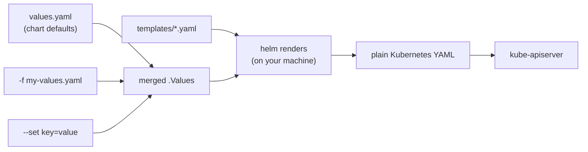
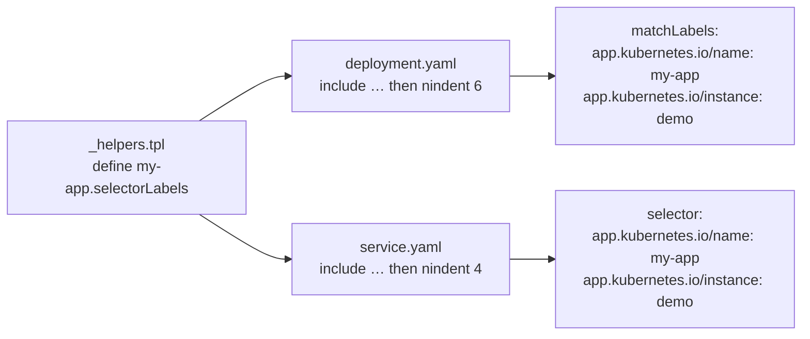
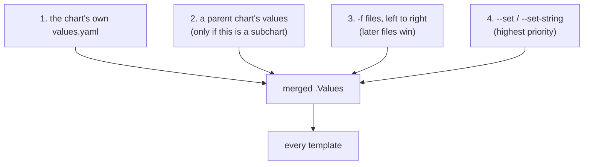
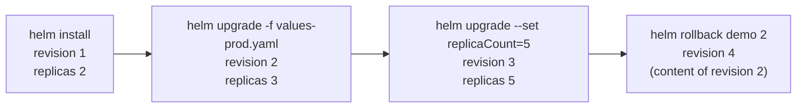
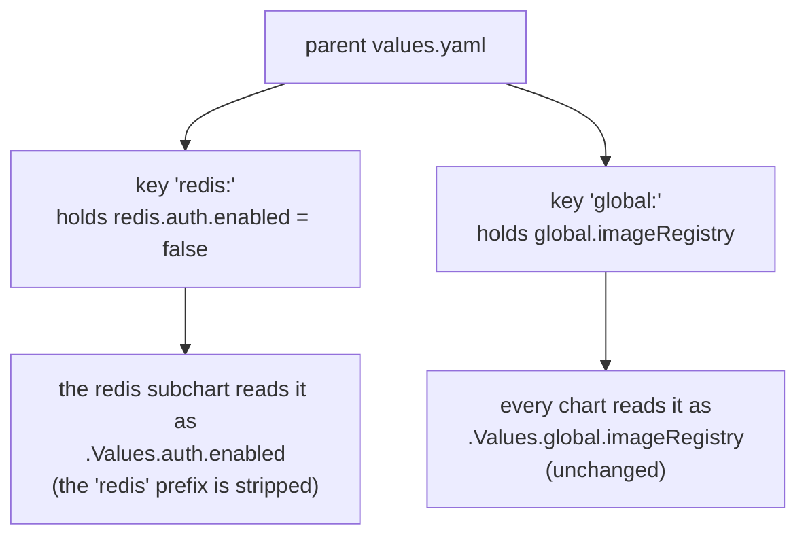

# Helm

> The package manager for Kubernetes — template your manifests, install them as one versioned unit, and learn to read the charts your team already has.

---

By now you have a pile of manifests — Deployment, Service, ConfigMap, Ingress — and for dev/staging/prod they're *almost* identical, differing by a replica count or an image tag. Copy-pasting and hand-editing that per environment is how mistakes happen. **Helm** is the package manager for Kubernetes: it **templates** your manifests and installs them as one versioned, upgradeable unit.

Most people meet Helm from the other direction, though: someone hands you a repository and says "the app is deployed by that chart." You open `templates/deployment.yaml` and instead of YAML you find this:

```yaml
metadata:
  name: {{ include "my-app.fullname" . }}
  labels:
    {{- include "my-app.labels" . | nindent 4 }}
```

That is the real goal of this chapter: **by the end you should be able to open an unfamiliar chart and explain what every line does.** We build up to it with a small chart you can render and install yourself.

## How to read this chapter

It's a long one, so here's the map. Four parts, and only the last one needs a cluster:

| Part | Sections | What you get | Cluster? |
|---|---|---|---|
| **A — Setup** | [Before you start](#before-you-start), [First run](#first-run) | Helm installed, one release created and deleted | for First run only |
| **B — The model** | [four nouns](#the-four-nouns) → [rendering](#how-rendering-actually-works) → [chart anatomy](#anatomy-of-a-chart) → [built-in objects](#the-objects-available-in-a-template) | You can say what a chart *is* and what Helm does to it | no |
| **C — The syntax** | [the five things](#the-five-things-that-trip-readers-up), [two annotations](#two-annotations-worth-recognizing) | **The core skill: reading someone else's templates** | no |
| **D — Operating** | [values](#where-values-come-from), [releases](#releases-and-revisions), [hands-on](#hands-on), [third-party charts](#using-someone-elses-chart), [subcharts](#subcharts-and-dependencies), [checklist](#a-checklist-for-reading-an-unfamiliar-chart) | Install, upgrade, roll back, and audit real releases | yes, for hands-on |

**Short on time?** Skim B, then work through C with `helm template` running in a second terminal. That alone gets you to "I can read my team's chart" — which is why none of it requires a cluster.

## Before you start

If you've never touched Helm, here's everything you need. Nothing in parts B and C needs a Kubernetes cluster, so if you're on a laptop without one, start anyway.

### 1. Install Helm

Unlike Kustomize (which is built into `kubectl`), Helm is a separate binary. It runs entirely on your machine and talks to the cluster through your normal kubeconfig — there is **no server-side component**, no Tiller, nothing to install into the cluster (that changed in Helm 3; old blog posts may tell you otherwise).

```bash
curl -fsSL https://raw.githubusercontent.com/helm/helm/main/scripts/get-helm-3 | bash
helm version --short
```

Package managers work too (`brew install helm`, `apt-get install helm`, `choco install kubernetes-helm`). That script installs a single binary into `/usr/local/bin`, escalating with `sudo` if it needs to — the same caveat the [README](../../README.md#prerequisites) makes about piping a remote script into a shell applies here, so read it first if that matters to you.

### 2. Get this repository

Every path in this chapter is relative to the repo root, so clone it and stay there:

```bash
git clone https://github.com/r97221004/k8s-tutorial.git
cd k8s-tutorial
helm lint manifests/packaging/helm/my-app     # your first Helm command — no cluster needed
```

If that prints `1 chart(s) linted, 0 chart(s) failed`, your setup is good enough for the whole first half.

### 3. A cluster, for the hands-on lab

Any cluster works — the [kubeadm one this guide builds](../getting-started/setup-kubeadm.md), or the k3s fast lane from the [README prerequisites](../../README.md#prerequisites). Verify with:

```bash
kubectl get nodes    # one node, STATUS Ready
helm list            # an empty table — NOT an error
```

That second command is the one beginners should run first. `helm list` failing with `Error: Kubernetes cluster unreachable` is never a Helm problem — it means Helm couldn't use your kubeconfig, so fix `kubectl` first.

One gotcha worth knowing early: **`--dry-run` still needs a cluster.** `helm install --dry-run` contacts the apiserver for version discovery and validation, so it fails without one. The cluster-free way to see rendered output is `helm template`, which is why this chapter reaches for it constantly.

### 4. The rest

- **Internet access** — to install Helm, to pull `nginx:1.27` from Docker Hub for the lab, and for `helm repo add` in [Using someone else's chart](#using-someone-elses-chart). Air-gapped? The render-only half still works.
- **bash or zsh** — a couple of examples use `diff <(…) <(…)` (process substitution), which `sh`/`dash` doesn't support.
- **Cluster headroom** — the lab peaks at 3 nginx replicas requesting 300m CPU / 384Mi total, comfortable inside the 2 vCPU / 4 GB single-node lab the README describes.
- **Optional:** [k9s](../getting-started/k9s.md) for the watch points below (`kubectl get -w` works too), and an Ingress controller *only* if you flip `ingress.enabled` on — the lab deliberately leaves it off.
- Everything installs into the **`default` namespace**, like the rest of this guide.

## First run

If you have a cluster, spend one minute here before any theory — having seen Helm *work* makes the rest read much faster. (No cluster? Skip to [The four nouns](#the-four-nouns); nothing below depends on this.)

```bash
helm install demo manifests/packaging/helm/my-app
kubectl get deploy,svc,cm -l app.kubernetes.io/instance=demo
helm uninstall demo
```

One command created a Deployment, a Service *and* a ConfigMap; one command removed all three. That's the whole value proposition — a set of related objects managed as a single named thing.

Two things probably looked odd, and both are answered later, so don't chase them now: the objects are called `demo-my-app` rather than `demo` (that's the [`fullname` helper](#3-_helperstpl-define-and-include)), and you never wrote any of that YAML by hand (that's [rendering](#how-rendering-actually-works)).

## The four nouns

- **Chart** — a package of templated manifests + default values (a folder, or a `.tgz`).
- **Values** — the knobs (`values.yaml`, or `--set`/`-f` overrides) injected into the templates.
- **Template** — a manifest with placeholders, e.g. `replicas: {{ .Values.replicaCount }}`.
- **Release** — one *installation* of a chart into a cluster, with a name and a revision history.

One chart, many releases with different values = the same app across every environment, without copy-paste.

## How rendering actually works

This is the single most useful mental model, and it clears up most confusion: **the cluster never sees a template.** Helm renders templates to plain YAML on your machine, then sends that YAML to the apiserver — the same YAML `kubectl apply` would have sent.



Two consequences worth internalizing:

- **`helm template` shows you the truth.** Any time a chart confuses you, render it and read the output. You are never guessing.
- **The apiserver cannot help you debug a template.** A typo inside `{{ }}` is a Helm-side error you'll see locally, before anything reaches the cluster.

## Anatomy of a chart

`helm create` scaffolds a chart, and nearly every chart you meet follows its shape. This guide ships a small but realistic one at [`manifests/packaging/helm/my-app/`](../../manifests/packaging/helm/my-app/):

```
manifests/packaging/helm/
├── values-prod.yaml         # a per-environment override — deliberately OUTSIDE the chart
└── my-app/                  # ← the chart is this directory
    ├── Chart.yaml           # the chart's identity and version
    ├── values.yaml          # default values — the chart's public API
    ├── .helmignore          # what to leave out when packaging a .tgz
    └── templates/
        ├── _helpers.tpl     # reusable snippets — underscore = not a manifest
        ├── deployment.yaml
        ├── service.yaml
        ├── configmap.yaml
        ├── ingress.yaml     # rendered only when ingress.enabled is true
        └── NOTES.txt        # the message printed after `helm install`
```

`values-prod.yaml` sits *outside* `my-app/` on purpose, and it's worth understanding why before you copy the layout: `helm package` bundles **everything inside the chart directory** into the `.tgz`. Put your production values in there and they ship to everyone who installs the chart. The chart is the artifact you distribute; your per-environment values are your own deployment config, so they live next to it, not in it.

| File | What it's for |
|---|---|
| `Chart.yaml` | Name, `version` (the chart's version), `appVersion` (the app inside it), and `dependencies` (subcharts) |
| `values.yaml` | **Read this first.** Every knob the chart author intended you to turn, with defaults |
| `templates/*.yaml` | Manifests with `{{ }}` placeholders. One file per resource, by convention |
| `templates/_helpers.tpl` | Named snippets shared by the other templates. Files starting with `_` are never rendered as manifests |
| `templates/NOTES.txt` | Printed after install/upgrade. Templated like everything else — usually "here's how to reach your app" |
| `charts/` | Subcharts, vendored in as `.tgz` (absent here — see [Subcharts](#subcharts-and-dependencies)) |
| `Chart.lock` | Resolved subchart versions, like `package-lock.json` (absent here) |

The two things beginners misread: `templates/` is not only for `kind:` resources (`_helpers.tpl` and `NOTES.txt` live there too), and `version` vs `appVersion` are different — bumping your chart's templates bumps `version`, shipping a new app image bumps `appVersion`.

## The objects available in a template

Inside `{{ }}`, `.` is the **root context** — an object with everything Helm knows. When you see a value appear out of nowhere in a chart, it came from one of these:

| Object | Contains | Example |
|---|---|---|
| `.Values` | The merged values (defaults + your overrides) | `.Values.replicaCount` |
| `.Release` | Facts about *this installation* | `.Release.Name`, `.Release.Namespace`, `.Release.Revision`, `.Release.Service` |
| `.Chart` | The contents of `Chart.yaml` | `.Chart.Name`, `.Chart.Version`, `.Chart.AppVersion` |
| `.Capabilities` | What the target cluster supports | `.Capabilities.KubeVersion.Minor` |
| `.Files` | Non-template files in the chart, for embedding | `.Files.Get "config/nginx.conf"` |
| `.Template` | The file currently being rendered | `.Template.BasePath`, `.Template.Name` |

Note the capital letters — `.values` will not work. And `.Release.Name` is chosen at install time (`helm install demo ./my-app` → `demo`), which is why chart authors use it to name objects: two releases of one chart must not collide.

## The five things that trip readers up

This is the longest section in the chapter and the one that actually buys you the skill. Start with this table — it's enough to make sense of most charts today — then read the five sub-sections for the *why*.

| # | What you'll see | What it means |
|---|---|---|
| 1 | `{{- … -}}` | Chomps the whitespace around the tag. Punctuation, not logic — read past it |
| 2 | `toYaml . \| nindent 8` | Paste this values block in, indented 8 spaces |
| 3 | `include "my-app.labels" .` | Insert a named snippet defined in `_helpers.tpl` (the trailing `.` passes the context) |
| 4 | `if` / `with` / `range` | Conditional / scope-shift / loop. **Inside `with` and `range`, `.` changes meaning — `$` is always the root** |
| 5 | `default` / `quote` / `required` | Fall back to a value / wrap in quotes / fail with a message |

If you remember only one line of it, make it the `$` note in row 4 — that's the one that makes people misread charts.

Everything below is in [`manifests/packaging/helm/my-app/`](../../manifests/packaging/helm/my-app/), so you can render each one and see the result.

### 1. `{{-` and `-}}` — whitespace control

A `{{ if }}` on its own line still leaves that line's whitespace and newline in the output. YAML cares about whitespace, so charts are littered with `-` to chomp it: `{{-` removes whitespace *before* the tag, `-}}` removes it *after*.

| Written | Meaning |
|---|---|
| `{{ .Values.x }}` | Substitute, touch no surrounding whitespace |
| `{{- .Values.x }}` | Delete whitespace and newlines **before** the tag |
| `{{ .Values.x -}}` | Delete whitespace and newlines **after** the tag |
| `{{- if … }}` | The control line itself leaves no blank line behind |

Without chomping:

```yaml
metadata:
  {{ if .Values.enabled }}
  key: value
  {{ end }}
```

```yaml
metadata:
  
  key: value
```

That stray indented blank line is harmless here but is the classic cause of "YAML parse error" once it lands somewhere structure-sensitive. With `{{-`:

```yaml
metadata:
  {{- if .Values.enabled }}
  key: value
  {{- end }}
```

```yaml
metadata:
  key: value
```

Rule of thumb when reading: **`-` is punctuation, not logic.** It never changes *which* values get emitted, only the whitespace around them — so when you're working out what a chart produces, read past it. (Whitespace is not nothing in YAML, which is exactly why chart authors are so fussy about it.)

Comments follow the same idea. A `#` comment is ordinary YAML and survives into the rendered output; `{{/* … */}}` is a *template* comment and disappears. The chart's templates use `{{- /* … */}}` so the explanatory notes never show up in what gets applied.

### 2. `toYaml` and `nindent` — indentation as a function call

A chart often wants to drop a whole block of user-supplied YAML into a manifest. `toYaml` converts a values object back into YAML text, and `nindent N` adds a newline and indents every line by N spaces:

```yaml
          {{- with .Values.resources }}
          resources:
            {{- toYaml . | nindent 12 }}
          {{- end }}
```

Given `values.yaml`:

```yaml
resources:
  requests:
    cpu: 50m
```

that renders as:

```yaml
          resources:
            requests:
              cpu: 50m
```

`indent` and `nindent` differ by exactly one newline: `nindent` = newline + `indent`. That's why you see `{{- toYaml . | nindent 4 }}` right after a `key:` on the previous line — the `{{-` eats the newline, and `nindent` puts back a newline plus correct indentation. Getting the number wrong is the most common way to break a chart, and it shows up immediately in `helm template`.

### 3. `_helpers.tpl`, `define`, and `include`

Real charts almost never write `name:` directly. They define a snippet once and pull it in everywhere. Our chart's `_helpers.tpl` defines five, and between them they account for nearly every `{{ }}` in the other templates — so when a chart's `metadata:` looks like nothing but `include` calls, this file is what you read:

| Helper | Produces |
|---|---|
| `my-app.name` | The chart's short name (`my-app`), or `nameOverride` if set |
| `my-app.fullname` | The name every object gets (`demo-my-app`) — dissected further down |
| `my-app.chart` | `name-version` (`my-app-0.2.0`), for the `helm.sh/chart` label |
| `my-app.labels` | The full label set for every object, including the selector labels |
| `my-app.selectorLabels` | Just the labels a selector matches on |

Here's the smallest of them, and how a template uses it:

```yaml
{{/* in templates/_helpers.tpl */}}
{{- define "my-app.selectorLabels" -}}
app.kubernetes.io/name: {{ include "my-app.name" . }}
app.kubernetes.io/instance: {{ .Release.Name }}
{{- end }}
```

```yaml
{{/* in templates/deployment.yaml */}}
  selector:
    matchLabels:
      {{- include "my-app.selectorLabels" . | nindent 6 }}
```



This isn't style for its own sake. A Service's `selector` must match a Deployment's `matchLabels` exactly, and a Deployment's `selector` is **immutable** after creation — one helper used by both files makes that impossible to get wrong.

Three details to know when reading:

- **The `.` at the end matters.** `include "name" .` passes the root context to the snippet. Pass nothing and `.Values` is undefined inside it. Inside a `range` or `with`, chart authors write `include "name" $` for the same reason (see below).
- **`include` vs `template`.** Both call a snippet; only `include` returns a *string*, so only `include` can be piped into `nindent`. `{{ template "x" . }}` cannot be indented, which is why modern charts use `include` almost exclusively.
- **Names are global and namespaced by convention.** Every `define` in every chart *and subchart* shares one namespace, hence the `my-app.` prefix.

The `fullname` helper is worth reading in full, because it explains the object names you'll see in the cluster:

```yaml
{{- define "my-app.fullname" -}}
{{- if .Values.fullnameOverride }}
{{- .Values.fullnameOverride | trunc 63 | trimSuffix "-" }}
{{- else }}
{{- $name := default .Chart.Name .Values.nameOverride }}
{{- if contains $name .Release.Name }}
{{- .Release.Name | trunc 63 | trimSuffix "-" }}
{{- else }}
{{- printf "%s-%s" .Release.Name $name | trunc 63 | trimSuffix "-" }}
{{- end }}
{{- end }}
{{- end }}
```

Read it as a chain of fallbacks: an explicit `fullnameOverride` wins; otherwise it's `<release>-<chart>`; unless the release name already contains the chart name, in which case don't stutter. `trunc 63` exists because Kubernetes names used as DNS labels max out at 63 characters, and `trimSuffix "-"` cleans up a truncation that lands on a hyphen. So:

| Command | Objects named |
|---|---|
| `helm install demo ./my-app` | `demo-my-app` |
| `helm install my-app ./my-app` | `my-app` (no stutter) |
| `helm install demo ./my-app --set fullnameOverride=custom` | `custom` |

This is why `kubectl get deploy` after a Helm install rarely shows the name you typed.

### 4. `if`, `with`, and `range`

**`if`** guards whole resources. `templates/ingress.yaml` wraps its entire body so that nothing is emitted unless you ask for it:

```yaml
{{- if .Values.ingress.enabled }}
apiVersion: networking.k8s.io/v1
kind: Ingress
# …
{{- end }}
```

Helm treats `false`, `0`, `""`, an empty list/map, and `nil` as false — everything else is true.

**`with`** does two jobs at once: skip the block if the value is empty, *and* rebind `.` to that value inside it.

```yaml
      {{- with .Values.nodeSelector }}
      nodeSelector:
        {{- toYaml . | nindent 8 }}
      {{- end }}
```

Inside that block `.` is `.Values.nodeSelector`, not the root — which is the number-one gotcha in reading charts. If you need the root inside a `with` or `range`, use **`$`**, which always refers to it.

**`range`** iterates. Over a map you get key and value; over a list you get each item:

```yaml
data:
  {{- range $key, $value := .Values.config }}
  {{ $key }}: {{ $value | quote }}
  {{- end }}
```

```yaml
data:
  GREETING: "hello from values.yaml"
  LOG_LEVEL: "info"
```

And here is `$` in action, from `templates/ingress.yaml` — inside two nested `range`s, `.` is the current path, so the root has to be reached explicitly:

```yaml
              service:
                name: {{ include "my-app.fullname" $ }}
                port:
                  number: {{ $.Values.service.port }}
```

### 5. The functions you'll see constantly

Helm ships the [Sprig](https://masterminds.github.io/sprig/) function library. You don't need to memorize it, but these show up in nearly every chart:

| Function | Does | Typical use |
|---|---|---|
| `default` | Falls back when the value is empty | `.Values.image.tag \| default .Chart.AppVersion` |
| `quote` | Wraps in double quotes | `{{ $value \| quote }}` — keeps `true`/`123` from becoming a bool/int |
| `required` | Fails the render with your message | `required "image.tag must be set" .Values.image.tag` |
| `toYaml` | Object → YAML text | pairing with `nindent` (above) |
| `nindent` / `indent` | Newline + indent / indent | inserting blocks at the right depth |
| `printf` | Format a string | `printf "%s-%s" .Release.Name $name` |
| `sha256sum` | Hash a string | the `checksum/config` annotation (below) |
| `b64enc` | Base64-encode | Secret `data:` values |
| `tpl` | Render a *value* as a template | letting users put `{{ }}` inside their own values |
| `trunc` / `trimSuffix` | Cut to length / strip a suffix | the 63-character name limit |

`required` is the polite way a chart demands input. Swap `default .Chart.AppVersion` for `required "image.tag must be set"` in `deployment.yaml`, leave `image.tag` empty, and the render stops with a message you can act on:

```
Error: execution error at (my-app/templates/deployment.yaml:26:52): image.tag must be set
```

Compare that to what you get when a chart *doesn't* validate and a whole section of values is absent — delete the `image:` block from `values.yaml` and render:

```
Error: template: my-app/templates/deployment.yaml:26:28: executing "my-app/templates/deployment.yaml" at <.Values.image.repository>: nil pointer evaluating interface {}.repository
```

`nil pointer evaluating interface {}.<key>` always means the same thing: **a parent key in the path doesn't exist.** Here `.Values.image` itself is missing, so there is nothing to look `repository` up on — the error names the child, but the missing thing is the parent. Note that `required` cannot rescue you from this: it checks the final value, so the nil dereference happens first.

## Two annotations worth recognizing

**`checksum/config`** solves a problem you already hit in [ConfigMaps](../config-and-data/configmap.md): editing a ConfigMap does not restart the Pods that read it, so you had to run `kubectl rollout restart` by hand. Charts automate that — they hash the rendered ConfigMap into the Pod template, so a changed value changes the Pod spec, and the Deployment rolls on its own:

```yaml
      annotations:
        checksum/config: {{ include (print $.Template.BasePath "/configmap.yaml") . | sha256sum }}
```

Read it inside-out: `$.Template.BasePath` is the chart's `templates/` directory, `include` renders that file to a string, `sha256sum` hashes it. Change `config.GREETING` and the annotation changes with it.

**`helm.sh/hook`** marks a resource as a lifecycle hook rather than part of the app — most often a Job that runs a database migration before the new version starts:

```yaml
  annotations:
    helm.sh/hook: pre-upgrade
    helm.sh/hook-weight: "0"
    helm.sh/hook-delete-policy: before-hook-creation
```

Hooked resources are applied at their phase (`pre-install`, `post-install`, `pre-upgrade`, `pre-delete`, …), ordered by weight, and are **not** managed as part of the release afterwards. If you find a Job in a chart that seems to run out of band, check its annotations.

## Where values come from

Every override lands in the same merged `.Values` object, with a fixed priority:



Merging is **per key, recursively** — `-f values-prod.yaml` that sets only `replicaCount` leaves every other default intact. The exception is lists: a list is replaced wholesale, never merged element-wise.

Three commands answer "what values are in play":

```bash
helm show values manifests/packaging/helm/my-app   # the chart's documented defaults
helm get values demo                               # only the overrides you supplied
helm get values demo --all                         # everything, defaults included
```

For a third-party chart, `helm show values` is where you should always start — it's the chart's API documentation.

## Releases and revisions

Every `install`/`upgrade`/`rollback` creates a new **revision**, and Helm keeps the old ones. This includes rollbacks, which roll *forward* to a new revision containing old content:



That history is not stored in Helm's own database — it lives in the cluster, as one Secret per revision in the release's namespace:

```bash
kubectl get secret -l owner=helm
# sh.helm.release.v1.demo.v1, sh.helm.release.v1.demo.v2, …
```

Which is why `helm list` only shows releases in the current namespace, and why deleting those Secrets by hand orphans a release.

The flags that matter in practice:

| Flag | Effect |
|---|---|
| `--install` (on `upgrade`) | Install if the release doesn't exist yet — makes CI idempotent |
| `--wait` | Don't report success until the resources are actually ready |
| `--atomic` | Roll back automatically if the upgrade fails (implies `--wait`) |
| `--dry-run` | Render and validate without applying |
| `--version` | Pin the chart version (always do this for third-party charts) |

`helm upgrade --install --atomic --wait` is the near-universal CI incantation.

## Hands-on

> **This is where a cluster becomes necessary** — see [Before you start](#before-you-start). The first two commands still work without one.

Render before you install, so you see the final YAML rather than trusting the templates:

```bash
helm lint manifests/packaging/helm/my-app
helm template demo manifests/packaging/helm/my-app
```

Note the names in the output — `demo-my-app`, from the `fullname` helper — and the labels the `my-app.labels` helper produced:

```yaml
metadata:
  name: demo-my-app
  labels:
    helm.sh/chart: my-app-0.2.0
    app.kubernetes.io/name: my-app
    app.kubernetes.io/instance: demo
    app.kubernetes.io/version: "1.27"
    app.kubernetes.io/managed-by: Helm
```

Now install it. `NOTES.txt` prints at the end:

```bash
helm install demo manifests/packaging/helm/my-app
```

```
my-app 1.27 is installed as release "demo".

  Revision: 1
  Replicas: 2

See what was created:

  kubectl get deploy,svc,cm -l app.kubernetes.io/instance=demo
...
```

That text comes from `templates/NOTES.txt`, rendered with the same context as everything else — which is why it can tell you your own release name and replica count.

```bash
helm list
kubectl get deploy,svc,cm -l app.kubernetes.io/instance=demo
```

The `app.kubernetes.io/instance` label is how you find everything belonging to one release — a habit worth keeping. In [k9s](../getting-started/k9s.md), `:deploy` ⏎ shows `demo-my-app` at `2/2`; leave it open for the next step.

Confirm the ConfigMap really reached the container as environment variables. The chart's Deployment pulls the whole ConfigMap in with `envFrom`, exactly as [Env Vars & Mounts](../config-and-data/env-and-mounts.md) covered — the only new thing here is that Helm generated both the ConfigMap and the reference to it:

```bash
kubectl exec deploy/demo-my-app -- printenv GREETING LOG_LEVEL
```

Now upgrade with a per-environment values file — the `-f` pattern that replaces hand-editing:

```bash
helm upgrade demo manifests/packaging/helm/my-app \
  -f manifests/packaging/helm/values-prod.yaml
helm history demo
```

Three things changed at once, and they're worth watching in k9s rather than polling: `:deploy` ⏎ shows `READY` climb from `2/2` to `3/3`, and `:pods` ⏎ shows **all** the Pods being replaced — not just the one new replica. That's `checksum/config` doing its job: `values-prod.yaml` changes `config.GREETING`, which changes the ConfigMap, which changes the checksum annotation in the Pod template, which rolls every Pod. Press `d` on the Deployment to see the new annotation value.

```bash
kubectl exec deploy/demo-my-app -- printenv GREETING   # now "hello from values-prod.yaml"
```

Compare what you asked for against what is actually deployed:

```bash
helm get values demo        # just the prod overrides
helm get manifest demo      # the exact YAML in the cluster
```

`helm get manifest` is the command to reach for when someone asks "what is actually running?" — it's the rendered truth for the current revision, not the chart's defaults.

Then undo it:

```bash
helm rollback demo 1
helm history demo           # revision 3 — a new revision holding revision 1's content
kubectl exec deploy/demo-my-app -- printenv GREETING   # back to "hello from values.yaml"
```

Finally, see how `if` gates a whole resource. Nothing was created for the Ingress until now, because `ingress.enabled` defaults to `false`:

```bash
helm template demo manifests/packaging/helm/my-app | grep -c "kind: Ingress"            # 0
helm template demo manifests/packaging/helm/my-app --set ingress.enabled=true \
  | grep -c "kind: Ingress"                                                             # 1
```

Rendering it is safe; actually installing it needs an Ingress controller — see [Ingress](../networking/ingress.md).

Clean up:

```bash
helm uninstall demo
kubectl get all -l app.kubernetes.io/instance=demo   # nothing
```

`helm uninstall` removes everything the release created, which is a real advantage over `kubectl delete -f` across a directory of files — Helm knows exactly what it created.

## Using someone else's chart

Installing third-party software is where Helm pays for itself. The workflow is: add the repo, read the values, pin a version, install.

```bash
helm repo add ingress-nginx https://kubernetes.github.io/ingress-nginx
helm repo update
helm search repo ingress-nginx --versions | head
helm show chart ingress-nginx/ingress-nginx
helm show values ingress-nginx/ingress-nginx | head -40
```

Every command above is read-only, so run them freely. Linger on `helm show values` — for a large chart that output runs to hundreds of lines, and it is the only documentation guaranteed to match the version you're installing. Find the handful of keys you need, put them in a values file, and pin the version (pick a real one from the `helm search repo --versions` output above):

```bash
helm install ingress-nginx ingress-nginx/ingress-nginx \
  --namespace ingress-nginx --create-namespace \
  --version 4.11.3 \
  -f my-ingress-values.yaml
```

Don't run that last one if you already installed a controller in the [Ingress](../networking/ingress.md) chapter — it's here to show the shape of a real third-party install, not as a step in this lab.

Added repos are a local setting, cached in your Helm config and not in the cluster. Drop it again when you're done exploring:

```bash
helm repo list
helm repo remove ingress-nginx
```

## Subcharts and dependencies

A chart can depend on other charts — an app chart that brings its own Redis, for example. Dependencies are declared in `Chart.yaml`:

```yaml
dependencies:
  - name: redis
    version: "20.x.x"
    repository: https://charts.bitnami.com/bitnami
    condition: redis.enabled
```

```bash
helm dependency update manifests/packaging/helm/my-app   # fetches into charts/, writes Chart.lock
```

`repository:` can also point at an OCI registry (`oci://…`), which is how a growing number of projects publish charts. `condition: redis.enabled` lets a user switch the whole subchart off. The part that confuses everyone is **values scoping**: a subchart only sees the values under its own key, with its own key stripped off.



So to set the Redis subchart's `auth.enabled`, the parent writes `redis.auth.enabled` — and the subchart's own templates still say `.Values.auth.enabled`. The `global:` key is the exception: it is visible, unchanged, to the parent and every subchart.

When you're reading a chart and a value seems to go nowhere, check whether it's addressed at a subchart.

## A checklist for reading an unfamiliar chart

In order, this gets you oriented in a few minutes:

| Step | Command / file | What you learn |
|---|---|---|
| 1 | `Chart.yaml` | What it is, its version, and whether it drags in subcharts |
| 2 | `helm show values <chart>` | The knobs — the author's intended interface |
| 3 | `ls templates/` | Which Kubernetes resources exist at all |
| 4 | `templates/_helpers.tpl` | The naming and labelling scheme every other file uses |
| 5 | `helm template <name> <chart>` | **The truth.** The exact YAML this chart produces |
| 6 | `helm template … -f their-values.yaml` | What your team's environment actually produces |
| 7 | `helm get manifest <release>` | What is deployed *right now*, which may lag the chart in Git |
| 8 | `helm get values <release> --all` | Which values that running release was given |

When a template still doesn't make sense, don't read harder — change a value and re-render. Diffing two `helm template` outputs answers "what does this knob do?" faster than any amount of squinting:

```bash
C=manifests/packaging/helm/my-app
diff <(helm template demo $C) <(helm template demo $C --set replicaCount=5)
```

## Helm or Kustomize?

Both solve "almost-identical manifests per environment," very differently — Helm templates, [Kustomize](kustomize.md) patches. That chapter has the [full comparison](kustomize.md#kustomize-vs-helm); the short version:

- ✅ **Helm** for reusable, distributable, values-driven packages, and for installing third-party software.
- ⚠️ For *your own* small set of manifests differing slightly per environment, Kustomize is often simpler — no templating language.

They're not mutually exclusive: plenty of teams install third-party software with Helm and manage their own manifests with Kustomize.

## Best practices

- **Pin chart versions** (`--version`) so installs are reproducible.
- **Keep per-environment values files in Git** (`values-prod.yaml`), and inject secrets separately — never commit real ones (see [Secrets](../config-and-data/secret.md)).
- **`helm template` or `--dry-run` before upgrading production**; the [`helm diff`](https://github.com/databus23/helm-diff) plugin shows the change against what's live.
- **`helm upgrade --install --atomic --wait`** in CI — idempotent, and self-reverting on failure.
- **Never `kubectl edit` a Helm-managed object.** The next `helm upgrade` renders from the chart and reverts you. Change the values instead.
- **Use `required` for values with no sane default** — a clear error beats a `nil pointer` one.
- **Prefer well-maintained upstream charts** over rolling your own for common software.

---

[← Ingress](../networking/ingress.md) · [↑ Contents](../../README.md) · [Kustomize (intro) →](kustomize.md)
